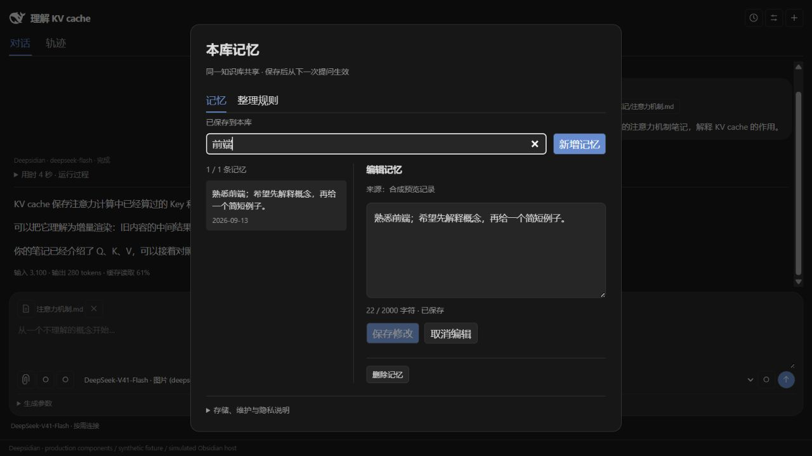
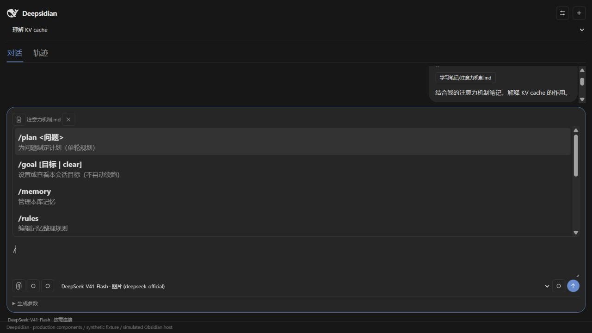
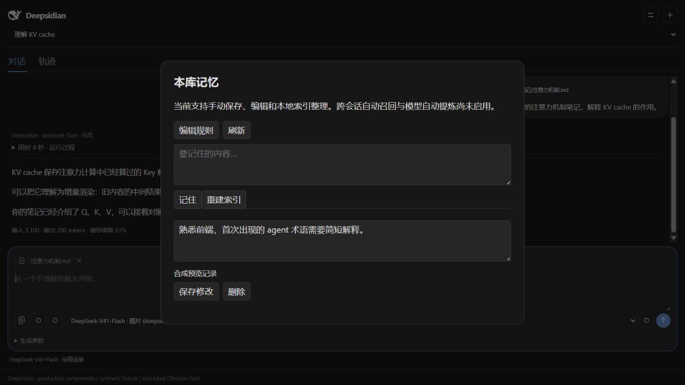

# Deepsidian

**0.5.0：同库记忆读取、会话级控制与手动模型提案。** 已保存的记忆可以参与新会话，修改/删除从下一次提问起更新。输入 `/extract` 选择会话，生成带原文来源的新增/更正提案，勾选确认后保存。闲时自动整理仍未实现。记忆系统完成前保持 0.5.x。下方历史版本段落保留当时状态，以本节为当前能力说明。



截图为生产组件＋合成数据＋模拟 Obsidian 宿主，不包含真实笔记。

- 使用 `/remember 内容` 保存，`/memory` 搜索、编辑或删除。读取开关位于插件设置，默认开启。
- 每轮提供最多12条摘要；`memory_search` 分页搜索、`memory_read` 按ID读取全文，使用记录可在轨迹查看。仅提供当前库的本轮快照。
- 删除或更正后，下一轮明确撤回旧记忆并使用最新版；已发送的聊天与DSH日志不会被擦除，模型是否遵循仍需实际验收。
- 新界面支持单条编辑、规则页、字数限制、保存/失败状态、取消删除；未提交草稿在本次插件运行期间暂存，重启前应保存。
- `/extract` 或记忆管理页“从会话提炼”：先限定最近 20 条用户消息，再排除已遗忘来源；连同现有记忆和 RULES 发送给当前模型。输入上限 40000 字符，最多 12 项提案；不发送助手回答、笔记上下文或附件。会产生模型调用费用，支持取消。
- 提案默认不勾选；更正展示修改前后，确认时重验来源、贡献权限与记忆版本，再一次性提交所选变更。删除提炼记忆会排除其原来源消息，但不保证其他消息中的同义事实永不再出现。
- `/organize` 仍只重建索引。未加入闲时自动提炼、语义去重或向量数据库。整理任务使用隔离的 DSH 进程和会话，工具列表为空；日志位于插件目录的 `.memory-runtime`，取消和遗忘不会抹掉模型已接收的数据或日志。


**让 DeepSeek Harness 在 Obsidian 的笔记上下文中工作。**

Deepsidian 是桌面端 Obsidian 插件：在侧栏与本地 DSH 运行时对话，主动引用笔记和截图，查看模型返回的思考、工具执行和会话轨迹。界面参考 DSH Web UI 的信息结构，并跟随 Obsidian 主题。

当前版本仍然停留在开发预览版。是个人用于学习Agent运行时和上下文/提示词工程的项目，非商业用途

## 界面预览

以下截图由本仓库实际视图组件渲染，实际字体、Markdown 排版和图标会跟随宿主主题。

| 对话与当前文件 | 可筛选的会话轨迹 |
| --- | --- |
|  |  |

<details>
<summary>首次使用引导</summary>


</details>

## 已有能力

- 对话侧栏：Markdown 回答、模型选择、思考强度、输出 token 上限、停止生成。
- 上下文：默认当前文件标志，可展开查看选区及附近段落，也可移除；支持主动选择库内文件、外部文本和粘贴截图。
- 可观察性：真实 reasoning 流、每轮耗时与用量、实际系统提示；轨迹包含输入/模型/工具时间概览、角色事件行、搜索、轮次与调用筛选。
- 笔记工具：关键词搜索、限量正文读取、大纲、标签、出站链接和反向链接。
- 原生联网：复用 DSH 原生 `web_search` / `web_fetch`，两个开关分别控制，新安装默认开启，保留已保存的关闭选择。
- 会话恢复：同一会话可以续聊；更换模型/参数或重启运行时后恢复历史，包括已发送图片。
- 自动连接：Obsidian 布局恢复后异步连接 DSH，可在设置中关闭；不发送模型请求，空闲约 5 分钟后释放。

## 环境与首次安装

此前主要验证环境为 **Windows、Obsidian 1.13.7、Node.js 24、DSH 0.1.5-rc.2**。本次在 macOS 上完成了类型检查、构建、31 项离线测试和 3 项本地合成服务集成测试；已在 macOS Obsidian 1.13.7 完成独立测试库的加载、连接、发送、取消和重载续聊验收，详见 [macOS 验收记录](docs/MACOS-VALIDATION.md)。manifest 声明最低 Obsidian 1.7.2，但该最低版本尚未实机验证。不支持移动端。

### 1. 准备 DSH

从 [Node.js 官网](https://nodejs.org/en/download) 安装 Node.js 24 或更新版本，然后在系统终端执行：

```sh
npm install -g @deepseek-ai/dsh@0.1.5-rc.2
dsh web
```

在 DSH Web 页面完成模型供应商配置并验证一次对话。API key 由 DSH 管理，Deepsidian 不提供自己的密钥输入框。配置完后可以关闭 DSH Web 服务；插件使用独立运行时。[DSH 官方说明](https://github.com/deepseek-ai/deepseek-harness)

2026-09-14 核对的最高已发布版本为 `0.1.5-rc.2`（npm `next`）；`latest` 仍指向 `rc.1`。这里使用精确版本以避免主包与子包混用，不代表它永远是最新版本。安装 Node/DSH 后重启 Obsidian。引导提供官方链接、可复制安装命令、路径覆盖及连接诊断；**目前是引导式手动安装，不是一键静默下载器**。

macOS 从 Finder 启动 Obsidian 时，应用的 PATH 可能与终端不同。若“检查并连接”提示找不到 DSH 或 Node，在终端执行 `npm root -g` 与 `command -v node`：将第一个结果追加 `/@deepseek-ai/dsh` 填入“DSH 包目录”，将第二个结果填入“Node 可执行文件”。请使用完整绝对路径；Apple Silicon 的 Homebrew 安装通常位于 `/opt/homebrew/lib/node_modules/@deepseek-ai/dsh` 和 `/opt/homebrew/bin/node`，以命令实际输出为准。Windows 可用 `where.exe node` 定位 Node。

### 2. 构建与安装插件

在此仓库根目录执行：

```sh
npm ci
npm run check
npm run install:dev -- "D:/Notes/MyVault"
```

最后一行替换为你已有的 Obsidian 库目录，目录中应有 `.obsidian`。也可以配置 `OBSIDIAN_VAULT` 环境变量。安装器只复制构建产物和版权文件，不覆盖既有聊天数据。

macOS 的安装命令示例（路径含空格时保留双引号）：

```sh
npm run install:dev -- "$HOME/Documents/MyVault"
```

可在 Finder 中找到自己的库目录并拖入终端获得路径；请替换示例路径。安装完成后，在 Obsidian 的“设置 → 第三方插件”中启用插件；已有版本需重新加载后才会运行新构建。

在 Obsidian 中启用 Deepsidian，点击鲸鱼图标，打开“开始设置”或标题栏设置图标，检查并连接。连接检查不会发出模型请求，因此不验证 API key 余额或云端模型权限；实际对话由已配置的供应商验证。

手动安装时，将 `dist` 中的 `main.js`、`manifest.json`、`styles.css`、`bridge.mjs`、`THIRD-PARTY-NOTICES.txt` 放入 `<vault>/.obsidian/plugins/deepsidian/`。

### 3. 使用

在笔记里选中一段文字，通过命令面板执行“解释选中的术语”，或直接在侧栏提问。当前文件以小文件标志显示，点击图标检查快照，点击 × 排除它。Ctrl/⌘ + Enter 发送。

附件支持 Markdown、常见 UTF-8 文本/代码，以及 PNG/JPEG/WebP/GIF。每轮最多 4 个附件，单图 5 MiB、单文本 100 KiB，总文本上下文最多 40000 字符。PDF 尚未解析。图片需使用模型目录中声明支持图片的模型；模型目录是候选目录，不保证账号拥有每个模型的访问权限。

生成参数在下一次发送时生效。参数或模型改变会重启插件专属进程，并以相同会话 ID 恢复历史；生成过程中不允许切换。

## 工具与提示词

| 工具 | 默认 | 范围 |
| --- | --- | --- |
| `obsidian_context` | 开启 | 发送时固定的路径、选区和附近段落 |
| `obsidian_search` | 开启 | 当前库 Markdown 关键词搜索；最多扫描 300 篇、返回 8 项 |
| `obsidian_read` | 开启 | 当前库 Markdown 正文片段，有路径、大小、行数限制 |
| `obsidian_metadata` | 开启 | 笔记大纲、行号、内联标签、出站链接、反向链接，均有数量上限 |
| `web_search` | 开启，可关闭 | DSH DeepSeek 原生搜索，最多 2 个查询、5 个结果 |
| `web_fetch` | 开启，可关闭 | DSH 匿名公网 HTTP(S) 读取，输出限 20000 字符 |

新安装默认提供网络工具；已有设置中的关闭选择会保留，可在设置中分别开启，下一次请求生效。默认提供工具不等于每次提问都调用网络，也不会在启动时发起搜索。DeepSeek 搜索使用其独立的搜索端点配置，可能产生额外模型费用与延迟；不会把聊天端点直接当成搜索端点。网页读取拒绝内网/本机地址，不执行页面 JavaScript，无法替代完整浏览器。

没有默认开放终端、任意文件访问、自动编辑或删除笔记。网络工具启用后，搜索查询会发送给搜索供应商，网页读取会访问目标网站；模型回答仍使用你配置的模型供应商。

系统提示使用 **DSH 的提示组装服务 + Deepsidian 的笔记助手角色**，包含引用和资料信任边界。每轮用户上下文包含明确背景和编辑快照；网络工具启用后由 DSH 加入工具使用指引。插件不会自动读取 `.obsidian` 配置，也不把保存过笔记等同于已掌握知识。可以在对话/轨迹中检查实际系统消息与模型输入。

## 存储、生命周期与性能

```text
<vault>/.obsidian/plugins/deepsidian/
├── data.json              # 设置、会话列表、UI 消息与轨迹快照
└── .runtime/
    ├── sessions/          # DSH 完整历史与恢复数据
    └── attachments/v1/    # DSH 已接收图片与请求版本
```

DSH 从原配置目录读取模型与凭证，插件会话与通常的 DSH Web UI 会话隔离，后者不会自动列出这些会话。未发送附件留在内存，关闭视图后不保留；已发送图片通过 DSH 附件服务持久化。

启用插件时仍需加载少量代码和 `data.json`，因此不能承诺零启动开销。0.4.0 在布局恢复后异步探测并连接 DSH，不阻塞布局恢复，也不扫描笔记库；更新检查也延后到连接后，最多每天一次，不自动升级。

空闲回收从最后一次连接/回答结束计时，约 5 分钟（检查间隔 30 秒）；正在生成时不回收。下一次提问有冷启动成本。历史与轨迹目前保存在单个 JSON 文件，特别长的历史仍可能影响加载和保存；分页与独立会话存储列入下一步。

时间带以**宿主接收事件时间**计算。模型阶段包含运行时准备，并不等于供应商纯推理耗时；输入为事件点，未收到结束事件会以未完成样式标注。可读轨迹详情有截断上限，完整原件保存在 DSH。没有供应商用量数据时不伪造缓存比例。旧版无法解析的快照不会补造缺失内容。

### 记忆基础与斜杠指令（0.4.0）

输入 `/` 显示菜单；方向键选择，Enter/Tab 填入指令，再按 Enter 执行（Shift+Enter 换行）。普通聊天仍用 Ctrl/⌘+Enter 发送。管理入口放在设置与命令面板。

| 指令 | 当前行为 |
| --- | --- |
| `/memory` | 打开本库记忆管理，新增/编辑/删除 |
| `/rules` | 编辑本库整理规则，供未来模型整理器使用 |
| `/remember 内容` | 显式保存一条记忆 |
| `/organize` | 本地重建已保存记忆的索引，无模型调用 |
| `/plan 问题` | 发起一次规划回答；是本插件的单轮规划入口 |
| `/goal 目标`、`/goal`、`/goal clear` | 设置/查看/清除本聊天目标；后续提问携带它，不自动续跑 |
| `/new`、`/connect`、`/help` | 新对话、连接、指令说明 |

**自动整理尚未实现。** 当前存储不自动召回到其他聊天，也不扫描历史提炼记忆。`/goal`、`/plan` 尚未接入 DSH 原生 goal driver/计划审阅机制，不能视为完整原生模式。未知指令不会悄悄发给模型；除 `/plan` 外的指令不接收附件，附件草稿会保留。

本库插件目录新增 `memory/RULES.md`、`topics/general.md`、`MEMORY.md` 和 `state.json`。正式内容在管理页编辑；索引重建最多列 50 条，首版保存最多 500 条、单条 2000 字符、单主题 128 KiB。记忆与规则编辑不启动 DSH。

存储有 revision 冲突检查、事务恢复和写锁；异常残留的 writer.lock 需要确认没有其他实例写入后手动处理。不支持跨设备并发写入，未提供撤销记录或断电级保证。旧学习背景保持停用，既有数据不迁移或删除。实现差异与后续 M1–M3 见 [技术设计](docs/MEMORY-DESIGN.md)。

<details>
<summary>0.4.0 指令与记忆管理组件预览（合成数据、模拟宿主）</summary>




</details>

## 开发与协作

```sh
npm ci
npm run check              # 类型检查、离线单元测试、生产构建
npm run doctor             # 本机 DSH 发现与版本诊断，不发模型请求
npm run test:integration   # 需已安装 DSH；合成服务、无需 API key
npm run preview            # 实际视图组件 + 模拟宿主，localhost:4173
```

`npm run live` 会使用已配置的真实供应商发送合成样例并可能产生费用，不在默认测试或 CI 中运行。自动测试不读取个人笔记。

代码按职责拆分：

```text
src/plugin/
├── main.ts         # 插件生命周期、请求协调与 Obsidian 工具宿主
├── view.ts         # 对话与输入交互
├── trace-view.ts   # 时间概览、角色事件行、筛选
├── setup.ts        # 首次使用与连接引导
├── settings.ts     # 模型路径与工具开关
├── dsh.ts          # 进程、协议适配、运行时配置
├── bridge.mjs      # 运行在 DSH 内的扩展
├── context.ts      # 编辑快照、路径限制
├── attachments.ts  # 主动附件校验与序列化
├── trace.ts        # 事件投影、reasoning 和用量
└── types.ts        # 前端持久状态类型
```

工程约定与分工建议见 [架构与协作说明](docs/ARCHITECTURE.md)。CI 配置在 Windows、macOS、Linux 上做类型检查、离线测试和构建；手动触发 workflow 时，在这三个平台安装固定版本 DSH 并运行集成测试。配置变更不代表远端 CI 已通过，执行结果以 GitHub 实际运行记录为准。

### 当前验证范围

- 本次 macOS 通过 31 项离线测试，包含路径发现、启动时机、连接去重、记忆事务及草稿、指令保存失败回滚和用量统计。
- 本次 macOS 通过 3 项 DSH/桥接集成测试，新增准备期取消的 8 个确定性场景；其余覆盖：工具、reasoning、取消、续聊、模型参数、图片及重启恢复；原生搜索来源链接、公网抓取边界。
- 浏览器组件预览：窄侧栏、轨迹搜索、事件展开和引导显示。
- macOS Obsidian 1.13.7 独立测试库：插件启用、连接与模型列表、中文笔记上下文、Ctrl/⌘ Enter、停止回答、用量与轨迹显示、重载后的历史恢复和续聊均通过；使用本地合成服务。截图粘贴尚未实机验收。
- 尚未完成全新机器安装、所有主题、长历史性能与多平台 Obsidian 实机验收；网络搜索尚未以真实付费账号验证服务权限。

## Roadmap

完整依据、竞品比较、工具候选、DAG/Canvas 数据设计与验收条件见 [产品调研与实施路线](docs/RESEARCH-ROADMAP.md)（2026-09-13）。待开发项不代表当前已支持。

| 阶段 | 状态 | 交付 |
| --- | --- | --- |
| 笔记对话与轨迹 | 已实现 | 流式回答、上下文、只读工具、会话恢复、模型参数、文件/图片、可筛选轨迹 |
| 启动与原生联网 | 已实现 | 手动引导、布局恢复后自动连接、空闲回收；新安装默认开启搜索/网页读取，可分别关闭 |
| P0 可靠性 | 下一步 | 按会话存储、历史分页、日志重建、全新机器验收、脱敏诊断、兼容矩阵 |
| P1 证据检索 | 待开发 | 标题/块引用、别名/属性过滤、链接邻居、词法排序、可检查的上下文清单 |
| P2 会话与画布 | 待开发 | 指定完成轮次 fork、父支线导航、带来源的摘要回主线；先 Canvas 文件互通，再评估 ThoughtDAG 适配 |
| P3 编辑与检索 | 待开发 | 手动短续写、局部 diff、Tab 灰字实验；按需语义索引 |
| P4 可选扩展 | 待开发 | Skills/MCP、文档/动态网页读取、受控写入与冲突处理 |
| P5 高级协作 | 研究候选 | 有预算和取消传播的子 agent；可执行画布与实时宿主适配 |

近期建议：**先完成会话存储和可定位的证据检索，再验证“从概念问题开支线、带来源回到主线”的日常工作流。** 补全与画布没有硬依赖；不会把所有研究功能塞进下一版。

## 来源与许可

- 运行时：[DeepSeek Harness](https://github.com/deepseek-ai/deepseek-harness)。
- 侧栏交互参考：[Claudian](https://github.com/YishenTu/claudian)。
- 上下文图方向参考：[ThoughtDAG](https://github.com/chenxiachan/thoughtdag)。当前没有复制其画布实现。
- 鲸鱼 SVG 来自 DSH Web frontend，已保留版权与 MIT 许可，见 [第三方声明](THIRD-PARTY-NOTICES.txt)。

本项目代码采用 [MIT License](LICENSE)。

## 历史版本 0.3.2：侧栏精简与记忆设计

已移除侧栏“学习背景”输入，停止把旧背景附加到新请求；旧设置仅保留作未来显式迁移，旧聊天历史不改写。上方截图对应此前版本，使用合成会话和模拟 Obsidian 宿主，尚未更新为 0.3.2 实机截图。

同库跨会话记忆、可编辑整理规则、合并/纠正/遗忘、可取消且有预算的闲时整理，详见 [Roadmap 第 9 节](docs/RESEARCH-ROADMAP.md#9-同库跨会话记忆与闲时整理实施设计)。记忆引擎、规则编辑器及后台整理尚未实现；当前只恢复同一 DSH 会话。类型检查、9 项离线测试与构建通过。


### 0.4.1 会话历史
顶部以当前会话标题和 Session history 图标替代常驻下拉选择框。点击图标展开历史，可搜索已保存的会话标题与用户/助手正文（多个关键词同时匹配，不区分大小写）。搜索不会调用模型或读取知识库文件。方向键选择、Enter 切换、Escape 关闭；生成或切换保存期间不能再次切换。

开发验证：`npm run check`；运行 `npm run preview` 后打开 `http://127.0.0.1:4173/?screen=history-tests` 查看9项真实组件 DOM 回归结果。预览采用合成会话和模拟 Obsidian 宿主；原生 Obsidian 的主题与弹出窗口仍需实机验收。


### 0.4.2 连接与持久化

启用“自动连接与侧栏唤醒”（默认开启）后，布局恢复时连接DSH；侧栏有焦点时保持连接，返回侧栏立即尝试连接。连接失败按2/4/8/16/30秒退避，在侧栏聚焦时继续重试，不弹重复通知；离开侧栏且没有请求约5分钟后休眠。连接不会发送聊天请求。成功连接后自动显示模型目录，已有配置无需手动走完引导。

新建会话、切换会话和目标修改采用保存成功后提交状态，避免失败操作被后台排队保存重新写入。UI优化清单见 [Roadmap](docs/RESEARCH-ROADMAP.md) 最后一节。记忆窗口本轮未改版，自动召回和闲时整理仍未实现。

### 会话级记忆控制（0.5.x）

输入 `/memory`，在“本会话”页分别控制读取本库记忆和允许贡献记忆，也可同时关闭。知识库总开关始终优先。关闭贡献会阻止本会话的 `/remember`；管理页的直接编辑仍可使用。设置保存在会话中，新会话使用默认值。这不是无痕模式，聊天历史仍会保存。

记忆系统完成前版本保持 0.5.x；手动模型提案已实现，闲时整理尚未实现，`/organize` 当前只重建本地索引。
