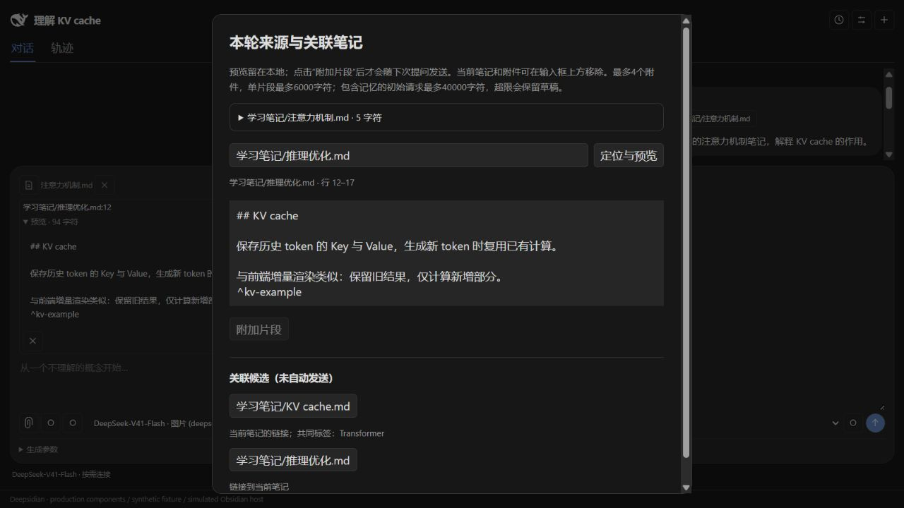

# Deepseedian

## Overview

Deepseedian is a desktop Obsidian assistant powered by a locally installed [DeepSeek Harness (DSH)](https://github.com/deepseek-ai/deepseek-harness) runtime. Ask questions with note context, inspect sources and citations, fork conversations, manage vault memory, generate local article catalogs and Bases, and request manual inline completion.

Version **0.7.0** is available on [GitHub Releases](https://github.com/DrTonks/deepseedian/releases/tag/0.7.0). The community directory submission is under review. The interface is currently primarily Chinese; an English interface is not yet available. Detailed Chinese documentation follows below.

### Installation

Requires **desktop Obsidian 1.13.7+**, **Node.js 24+**, and **DSH 0.1.7-rc.2**. Mobile devices are not supported. Install Node.js separately, then run:

```sh
npm install -g @deepseek-ai/dsh@0.1.7-rc.2
dsh web
```

Configure a model provider and its credentials in DSH and test a conversation there. You can then close DSH Web. Deepseedian starts a separate local runtime; it does not install or update Node.js, DSH, or itself.

Download `main.js`, `manifest.json`, and `styles.css` from the release into your vault's `.obsidian/plugins/deepsidian/` directory and enable **Deepseedian** in Community plugins. Keep `data.json` and runtime/memory directories when updating. The embedded bridge needs no separate download. The plugin ID remains `deepsidian` for compatibility with existing settings and conversations.

On macOS, Obsidian launched from Finder may have a different PATH from your terminal. If automatic discovery fails, set the full Node.js executable path and DSH package directory in advanced runtime settings. Find them with `command -v node` and `npm root -g`; on Windows, use `where.exe node`.

### Usage, payment, and privacy

- Select text and use the note-question command, or open the sidebar to chat. Inspect the next-message context before sending. Source removal does not erase already sent history.
- Manual completion is **off by default**. Enable it in settings, run the completion command in Markdown prose, then accept the gray suggestion with **Tab** or dismiss it with **Esc**. Acceptance is a separate undo step. Completion uses paid **deepseek-official / deepseek-flash**, independently of the chat model, and sends the title plus text around the cursor. It has no access to chat history, memory, or tools. Limits are 10 calls per minute and 200 per UTC day per vault, including failed or cancelled requests; these are not monetary limits.
- The plugin is free and open source. Cloud AI and search providers may require accounts, credentials, and payment; their fees are separate. AI chat may send questions, conversation history, selected note context, attachments, tool results, and enabled memory to the chosen provider. AI memory extraction and optional idle proposals also make model requests.
- Memory reading, AI memory management, web search, and web fetching are enabled by default for new installations; existing disabled settings are preserved. AI memory management can directly change vault memory when session permissions allow. Idle memory proposals and manual completion are off by default. Catalog generation and updates require confirmation and run locally.
- Web search sends queries to the configured search service; web fetching accesses public websites. The DSH update check queries the public npm registry at most daily by default, without note or chat content, and can be disabled.
- The plugin uses Node.js filesystem and child-process APIs to locate and run Node.js/DSH, read configuration and credentials from `~/.dsh` or a custom directory, and read explicitly attached external files. Chats, runtime logs, sent attachments, and memory are stored under the vault's plugin directory. No client-side telemetry is added. Remote services have their own data policies, including [DeepSeek's privacy policy](https://cdn.deepseek.com/policies/zh-CN/deepseek-privacy-policy.html).
- Note properties such as `draft` or `encrypted` are not access controls. Completion exclusions do not restrict chat tools. Publishing or reviewing this plugin does not require uploading personal articles.

AI suggestions can be incomplete or factually wrong. Read them before accepting; completion is not a fact-checking tool. The [0.7 validation report](docs/VALIDATION-0.7.0.md) records both successful and failed real-provider cases. Windows/Linux CI does not replace native UI testing, and third-party completion plugins, native input methods, and all themes have not been exhaustively tested. Runtime migration and three-file installation are covered by integration tests.

### Development and releases

Use Node.js 24+ and run `npm ci`, `npm run check`, and `npm run test:integration` (requires DSH). Older-runtime migration fixtures are optional and are reported as skipped when absent. `npm run package:release` produces the three release assets. Live-provider test scripts incur charges and use synthetic fixtures by default; real-article testing requires authorization. Reports and credentials must not be committed.

Source pushes alone do not deliver plugin updates. Increment the version, publish a matching Git tag and GitHub Release with the three assets, and check the community review results. See the [release guide](docs/COMMUNITY-RELEASE.md).

Licensed under [MIT](LICENSE). The DeepSeek whale icon's attribution and license are in [THIRD-PARTY-NOTICES.txt](THIRD-PARTY-NOTICES.txt) and included in the release bundle. The runtime uses DeepSeek Harness; sidebar interaction design draws inspiration from [Claudian](https://github.com/YishenTu/claudian). Deepseedian is an independent community project, not an official Obsidian or DeepSeek product.

---

## 中文说明

Deepseedian 是面向桌面端 Obsidian 的 AI 助手，通过本机 [DeepSeek Harness（DSH）](https://github.com/deepseek-ai/deepseek-harness) 连接模型供应商，在笔记上下文中完成问答、来源检索与会话管理。

当前版本为 **0.7.0 正式版本**，社区条目已创建，审核尚未完成。

[安装与环境](#安装与环境) · [使用说明](#使用说明) · [费用与隐私](#费用与隐私) · [开发与验证](#开发与验证) · [社区发布指南](docs/COMMUNITY-RELEASE.md)

## 主要功能

- **笔记问答**：围绕当前笔记、选区及附件提问，支持流式回答、停止生成、模型参数和用量展示。
- **来源与引用**：发送前检查上下文清单；按需查询文章属性、解析标题与普通段落块、查看关联候选，并跳转到引用原文。
- **会话分支**：从已完成的回答创建独立聊天，继承截至该轮的历史，支持返回父会话和重启恢复。
- **本库记忆**：手动保存、编辑和删除记忆；可选的 AI 管理、会话提炼和闲时待审提案。
- **文章目录**：本地预览并生成 Obsidian Base 表格和 Markdown 导航，支持已有导航生成区域的差异更新。
- **运行轨迹**：查看模型输入、工具调用、耗时及供应商返回的用量信息。
- **Tab补全**：显式请求单行灰字，Tab 接受、Esc 取消，接受结果可独立撤销；默认关闭。

插件不自动修改文章正文。目录生成与更新需要确认；手动补全仅在按下 Tab 后插入文本。AI 记忆管理开启且满足会话权限时，可直接修改本库记忆，无需逐条审批。

## 界面预览

| 对话侧栏 | 来源与关联笔记 |
| --- | --- |
|  |  |

## 安装与环境

| 项目 | 当前要求 |
| --- | --- |
| Obsidian | 桌面版 1.13.7 或更新版本；不支持移动端 |
| Node.js | 24 或更新版本，使用独立 Node.js 进程 |
| DeepSeek Harness | 当前验证基线为 `0.1.7-rc.2` |
| 模型服务 | 在 DSH 中配置可用的供应商和凭据；云端服务可能收费 |

### 1. 配置运行时

从 [Node.js 官网](https://nodejs.org/en/download) 安装 Node.js，然后在系统终端执行：

```sh
npm install -g @deepseek-ai/dsh@0.1.7-rc.2
dsh web
```

在 DSH 中配置供应商和模型，并验证一次对话。配置完成后可以关闭 DSH Web；Deepseedian 使用独立运行时。插件不提供 API key 输入框，也不会自动安装或更新 Node.js、DSH 或自身。

DSH 的 npm `latest` 标签可能与本项目验证版本不同，请使用上述精确版本。DSH 0.1.7 的官方 DeepSeek 适配器只支持 Messages：旧配置中的 `llm-deepseek.protocol` 需要移除，官方 `baseURL` 为 `https://api.deepseek.com/anthropic`。其他 Chat Completions 供应商通过 `llm-pi-ai` 配置。

Deepseedian 依次读取 DSH 配置目录中的 `settings.yaml`、`profiles/sdk-minimal/cordis.patch.yml` 和 `cordis.patch.yml`，仅导入明确按 ID 配置的模型、搜索与默认模型条目。后续层的 `config` 整体替换前一层，并保留最终禁用状态；不执行动态 YAML 表达式或导入其他工具插件。仅保存在 Web/Desktop 专属 profile 的配置需要放入上述共享文件，修改后重新连接。凭据仍由 DSH 读取。

### 2. 安装插件

从 [GitHub Release 0.7.0](https://github.com/DrTonks/deepseedian/releases/tag/0.7.0) 下载 `main.js`、`manifest.json` 和 `styles.css`，复制到笔记库的 `.obsidian/plugins/deepsidian/`。

也可以从源码构建同一版本：

```sh
git clone https://github.com/DrTonks/deepseedian.git
cd deepseedian
git checkout 0.7.0
npm ci
npm run check
npm run package:release
```

将 `dist/release/0.7.0/` 中的三个文件复制到笔记库的 `.obsidian/plugins/deepsidian/`：

```text
main.js
manifest.json
styles.css
```

然后在 Obsidian 的“设置 → 第三方插件”中启用 **Deepseedian**。更新已有安装时，保留 `data.json`、运行时目录和记忆目录，替换构建文件后重载插件。

本项目原名 Deepsidian。仓库与显示名称已更新，插件 ID 和安装目录继续使用 `deepsidian`，已有聊天和设置无需迁移。桥接代码已包含在 `main.js` 中，启动时生成到插件私有运行时目录，不需要另外下载 `bridge.mjs`。

开发者也可以在构建后运行：

```sh
npm run install:dev -- "/absolute/path/to/your/vault"
```

### 3. 检查连接

打开侧栏中的连接引导，或前往插件设置检查连接。连接检查不发送对话，因此不能验证模型权限、账户余额或回答质量。

macOS 从 Finder 启动 Obsidian 时，环境变量可能与终端不同。如果自动发现失败，执行 `npm root -g` 和 `command -v node`，在高级运行时设置中填写 DSH 包目录及 Node.js 的完整路径。Windows 可使用 `where.exe node` 定位 Node.js。安装或更改运行时后重启 Obsidian。

## 使用说明

### 围绕笔记提问

在 Markdown 编辑器中选中内容，右键选择“向 Deepseedian 提问”，或运行“围绕选区或当前段落提问”命令。插件保留已有问题草稿，准备选区本身不会发起模型请求。补充问题后使用发送按钮或 Ctrl/⌘+Enter 发送。

手动选区保存为会话草稿快照，包含附近段落、标题及行号；普通当前笔记在发送时重新捕获光标附近内容。发送前可通过“查看下次发送的上下文”核对来源、附件和记忆状态。移除当前文件会持续停止附带它，直到手动恢复；移除下一轮资料不会擦除已发送的历史。

附件支持常见 UTF-8 文本及 PNG/JPEG/WebP/GIF，图片需模型声明支持。每轮最多四个附件；PDF 尚未解析。模型可按需调用只读笔记工具，工具结果见运行轨迹。关联候选不等于已读取正文，笔记存在也不代表用户已掌握内容。

### 会话与记忆

已完成回答下的分支按钮创建独立续聊，创建动作本身不调用模型；续聊仍按所选供应商计费。分支隔离聊天历史，但本库记忆与笔记文件仍共享。缺少可靠事件边界的旧回答不能分支；不支持分支自动合并或结论回传。

记忆读取和 AI 记忆管理在新安装中默认开启，已有关闭设置会保留。直接管理记忆还需满足本会话的读取与贡献权限。可以通过 `/memory` 手动管理及撤销最近操作；`/extract` 生成的提案需要确认后保存。闲时生成提案默认关闭，开启后会产生模型请求与费用。

### 本地文章管理

使用 `/catalog` 选择文章范围和输出目录，先预览、再确认生成 Base 与导航。支持 `title`、`category/categories`、`tags`、`published/date/pubDate` 和布尔型 `draft`；发布日期优先读取 `published`。

Base 提供动态视图，导航是扫描时的快照。后续更新只修改可信导航的生成区域，保留原文章、已有 Base 和手写前后文；生成区被修改或预览失效时会拒绝覆盖。此流程在本地运行，不调用模型。

### 常用指令

| 指令 | 用途 |
| --- | --- |
| `/context [链接]` | 本地预览来源、关联候选和标题/块片段 |
| `/catalog` | 预览、生成或更新文章管理文件 |
| `/memory`、`/rules` | 管理记忆和整理规则 |
| `/remember 内容` | 手动保存一条记忆 |
| `/extract` | 审阅待审提案，或调用模型提炼会话 |
| `/organize` | 本地重建记忆索引，不调用模型 |
| `/goal [目标或 clear]` | 设置、查看或清除本会话目标 |
| `/plan 问题` | 发起一次规划回答，不会自动持续执行 |
| `/new`、`/connect`、`/help` | 新建会话、连接运行时、查看指令 |

### Tab手动补全

在设置中主动开启后，运行“请求当前位置补全”。补全固定使用付费 `deepseek-official / deepseek-flash`，与聊天所选模型可能不同；仅发送当前标题和光标前后片段，不读取聊天、记忆或关联笔记。

该功能不自动触发。候选只在 Tab 接受后写入，Esc 取消，编辑或移动光标会使旧候选失效。按 UTC 日期每库最多 200 次调用、每分钟 10 次，失败与取消也计入额度；这些是调用次数限制，不是金额上限。

补全可能延续错误前提或产生矛盾内容，不能作为事实校验工具。当前保持默认关闭，完整边界见 [手动补全说明](docs/TAB-COMPLETION.md)。

## 费用与隐私

| 操作 | 数据处理方式 |
| --- | --- |
| 来源预览、目录扫描、Base 生成、手动记忆编辑 | 本地处理，不调用模型 |
| AI 对话与笔记工具 | 问题、相关会话历史、显式上下文、工具返回内容及启用的记忆进入所选模型请求 |
| 会话提炼与闲时提案 | 允许贡献的用户消息、现有记忆及整理规则进入模型请求 |
| 手动补全 | 当前标题及光标前后片段发送给官方 DeepSeek |
| 网页搜索与读取 | 查询发送给配置的搜索服务；网页读取访问指定公网网站 |
| DSH 更新检查 | 默认每日最多查询 npm registry 的公开版本标签，不携带笔记或聊天，可关闭 |

云端 AI 通常需要供应商账号和凭据，可能产生费用。聊天使用 DSH 中配置的供应商；搜索可能另有权限与费用。网络搜索和网页读取在新安装中默认开启，可分别关闭；启用工具不代表每次对话都会调用它们。

插件需在库外读取 Node.js/DSH 安装文件，以及 `~/.dsh` 或自定义目录中的供应商配置与凭据；主动附加的外部文件也会被读取。聊天、运行时日志、已发送附件和记忆保存在本库的 `.obsidian/plugins/deepsidian/` 内。插件不添加客户端遥测；运行时和远端服务的数据处理另受其政策约束，例如 [DeepSeek 隐私政策](https://cdn.deepseek.com/policies/zh-CN/deepseek-privacy-policy.html)。

`draft`、`encrypted` 等笔记属性不是 AI 访问控制。补全排除目录只约束补全，不限制聊天工具。发送前请检查上下文；删除记忆或移除来源不会清除已发送的聊天、运行时日志或供应商已接收的数据。

## 当前限制与验证范围

- 当前为桌面端版本，需要手动准备 Node.js 和 DSH；不支持移动端。
- 标题、普通段落块及一跳关联已实现；复杂列表/表格块、任意 Base 公式求值、向量检索尚不支持。部分查询最多扫描 2000 篇，属性与链接缓存可能短暂滞后。
- 上下文清单记录宿主明确附带的来源，并非模型完整输入重放或精确费用估算。字符预算不覆盖全部历史及运行时内部重试。
- 聊天与轨迹仍集中保存在 `data.json`，长历史性能、跨设备并发和完整日志清理尚待完善。
- 最近发布前检查通过 159 项离线及 16 项运行时集成测试，包含旧历史迁移和标准三文件安装。macOS Obsidian 1.13.7 已验证连接、选区、分支、来源跳转、补全撤销和真实博客 Base 日期。
- Windows/Linux 的 CI 与模拟组件测试不能替代原生界面验收；全新机器、真实中文输入法、其他补全插件、所有主题及真实付费搜索权限仍有未验证项。本轮真实文章与合成补全测试均保留语义失败记录，不能以请求成功代表回答可靠。

本次真实文章结果见 [0.7 验证记录](docs/VALIDATION-0.7.0.md)。完整证据与边界见 [macOS 验收记录](docs/MACOS-VALIDATION.md)、[真实供应商验证](docs/LIVE-VALIDATION.md)及[研究路线图](docs/RESEARCH-ROADMAP.md)。

## 开发与验证

```sh
npm ci
npm run check
npm run doctor
npm run test:integration
npm run preview
npm run package:release
```

旧历史迁移验证需提供 `DSH_LEGACY_PACKAGE_ROOT` 与 `DSH_PREVIOUS_PACKAGE_ROOT`，缺少旧安装时会跳过相应场景。真实供应商脚本如 `live:selection`、`live:fork`、`live:manage`、`live:knowledge` 和 `live:completion` 使用合成资料并产生实际费用，不在默认测试或 CI 中运行。使用前配置自己的凭据，逐例核对完整回答；报告保存在忽略提交的 `.runs/`。

架构和代码入口见 [项目地图](docs/PROJECT-MAP.md)及[架构说明](docs/ARCHITECTURE.md)。报告问题请使用 [GitHub Issues](https://github.com/DrTonks/deepseedian/issues)，附上插件/Obsidian/Node/DSH 版本、复现步骤及脱敏错误。

维护者发布前需再次审查代码与构建产物，具体流程见 [社区发布指南](docs/COMMUNITY-RELEASE.md)。

## 许可与致谢

本项目采用 [MIT License](LICENSE)。DeepSeek 鲸鱼图标的来源与许可见 [第三方声明](THIRD-PARTY-NOTICES.txt)，声明也包含在发布构建中。

运行时基于 [DeepSeek Harness](https://github.com/deepseek-ai/deepseek-harness)，侧栏交互参考 [Claudian](https://github.com/YishenTu/claudian)。Deepseedian 是独立社区项目，不属于 Obsidian 或 DeepSeek 官方产品。
