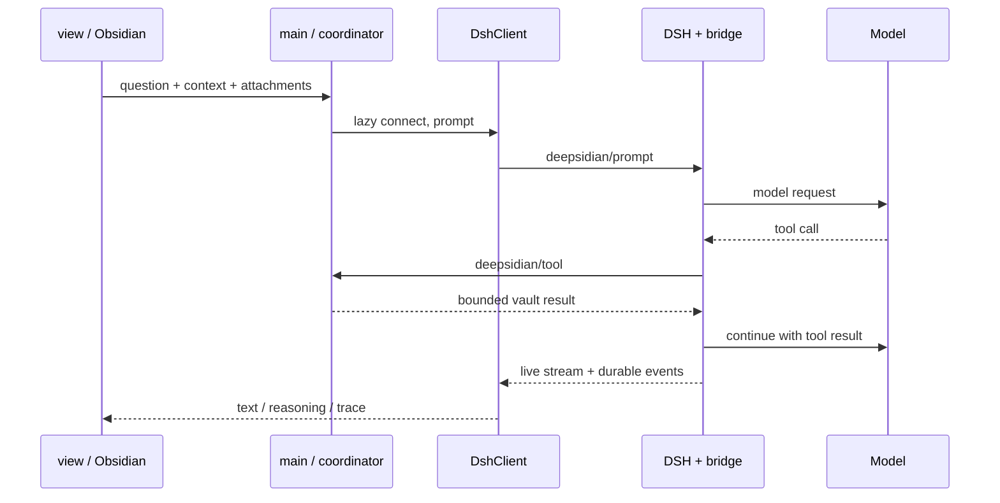

# 架构与协作说明

## 边界

Obsidian 端负责界面、编辑快照、文件选择与笔记 API。独立 Node 子进程运行 DSH sdk-minimal 组合，DSH 自己管理 agent loop、模型请求和持久历史。bridge.mjs 是运行在 DSH 内的 Cordis 扩展，通过 JSON-RPC 通道把宿主工具调用交回插件。

Web 工具由 DSH 原生插件注册和执行，不经 Obsidian handleTool。只有用户开启的 search/fetch 会挂载相应服务。凭证由 DSH 官方 credentials-local 服务解析，不复制到插件设置或仓库。

## 生命周期

`onload` 只加载插件状态并注册视图、命令、事件和回收计时器。`view.onOpen` 不连接，不探测安装。`connect` 在用户检查连接、刷新模型或发送时执行；`DshClient.start` 负责启动中的去重。闲置约五分钟执行 stop；活动请求不回收。取消优先调用 agent.cancel，异常时超时停止专属进程。卸载停止该进程。

参数变更不修改正在运行的一轮。空闲时释放进程，下次以同一个 sessionId 恢复，并使用新 route。模型目录来自 DSH 元数据；不等于账号授权列表。

## 数据兼容

`types.ts` 是前端持久状态约定。新增字段须可选或提供默认值；不要在普通升级时删除 `.runtime` 或重置聊天。`trace.ts` 支持补投影旧版的合法 JSON 快照；截断或不存在的数据不伪造恢复。当前数据尚未分页，不应把 UI 快照作为 DSH 完整日志使用。

图片先经 DSH admitEncodedImages 校验、规范化、持久化，再进入消息引用。附件 base64 仅用于传输和发送前预览，不直接堆进 data.json。UI 名称记录与运行时完整内容分开。

## 协作分工

| 方向 | 主要文件 | 验收 |
| --- | --- | --- |
| 界面与交互 | view.ts / trace-view.ts / styles.css | 窄侧栏、主题、键盘、折叠/滚动；组件与实机截图 |
| 运行时适配 | dsh.ts / bridge.mjs | test:integration；协议/取消/恢复/工具集合 |
| 上下文与检索 | context.ts / main.ts 的宿主工具 | 路径限制、读取上限、上下文快照、检索相关性 |
| 存储与生命周期 | main.ts / types.ts | 老数据迁移、崩溃恢复、冷/热启动测量 |

每个 PR 先描述用户可见行为，再记录实际验证。修改运行时接口必须运行集成测试；仅改 CSS 无须发真实模型请求。不要提交个人 vault、data.json、.runtime、.runs、.env、API key、绝对个人路径或未经脱敏的会话截图。

## 测试与预览

默认 `npm test` 不需要 DSH 或 API key。`npm run test:integration` 需要本机已安装已验证 DSH，仅启动本地模拟服务，测试资源写入被忽略的 .runs。`npm run live` 单独使用真实供应商，明确产生请求。

`npm run preview` 将生产 view/trace/setup 组件与 tests/ui/obsidian-mock.ts 一起构建，静态服务仅绑定 127.0.0.1:4173。三个入口为 `?screen=chat`、`?screen=trace` 和 `?screen=setup`。模拟宿主不提供真实 DSH 连接，Markdown 渲染器也是纯文本替身，所以组件截图不能取代 Obsidian 实机验收。README 截图使用合成资料，不含个人笔记。

## 版本与发布

已验证 DSH 0.1.5-rc.2。上游 developer preview 可能破坏接口；升级先核对包版本与新增能力，在分支运行集成测试，再更新 setup.ts、README 和 CI 中的兼容版本。不要只依赖 SDK initialize 中的 serverInfo.version。

发布前：运行 check 和 test:integration；构建；用明确 vault 参数安装；重载实机检查；更新 manifest/package 版本、截图和 README；确认 LICENSE 与第三方声明。当前脚本不执行 GitHub 发布、不自动安装或更新 DSH。

`npm run package:source` 导出白名单源码到仓库外的 publish/deepsidian。目标必须不存在，不覆盖旧导出；可以传入新的输出目录。它排除运行日志、依赖、构建产物与个人资料。导出是交接快照，后续开发仍在原工作目录进行。上传前可再人工查看导出文件列表。
