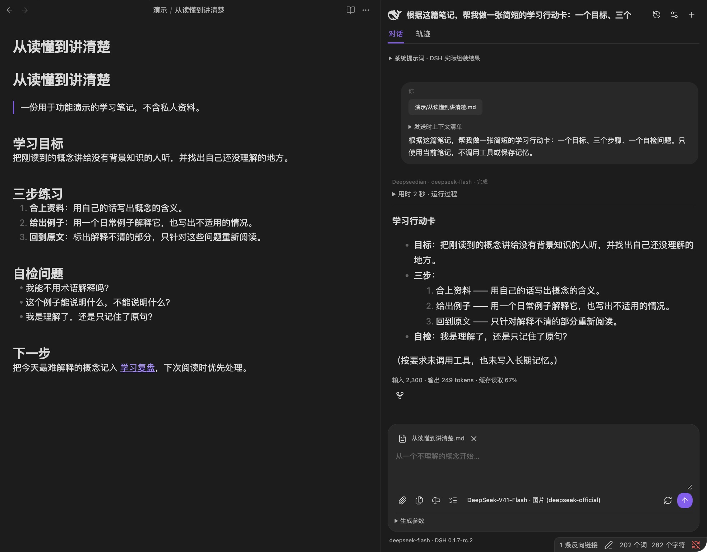
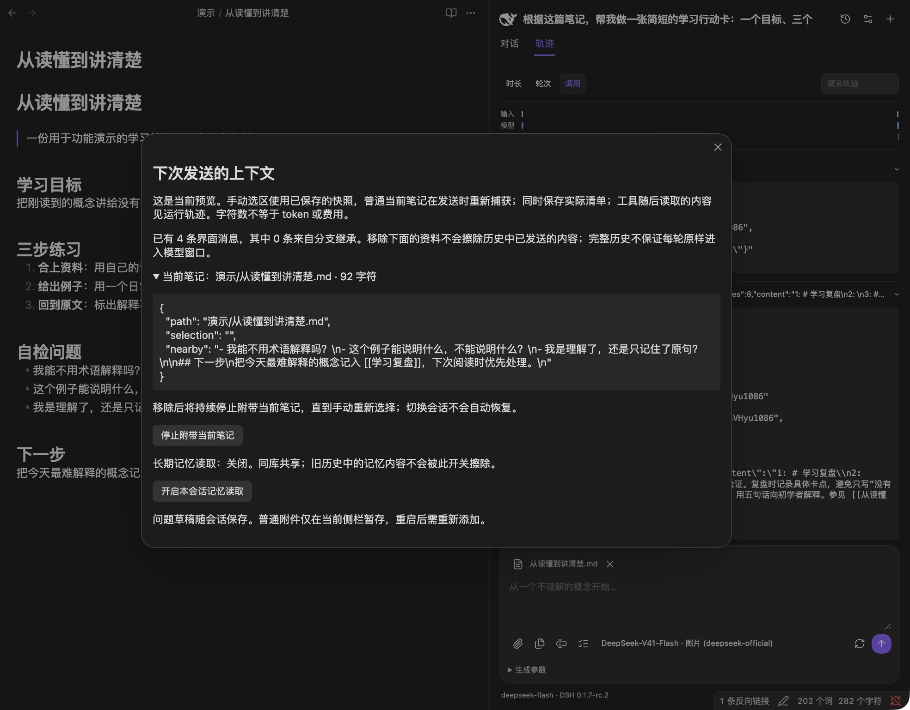
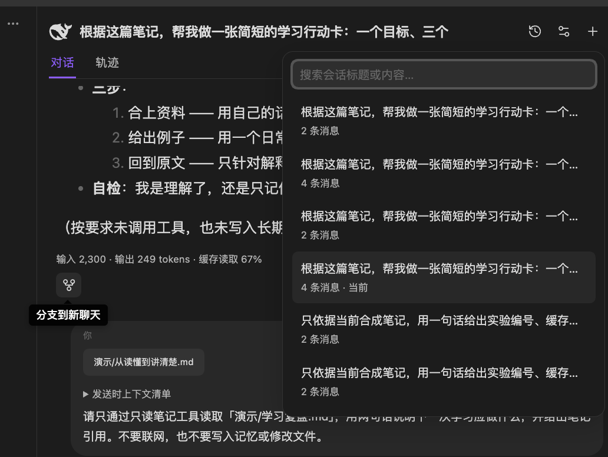
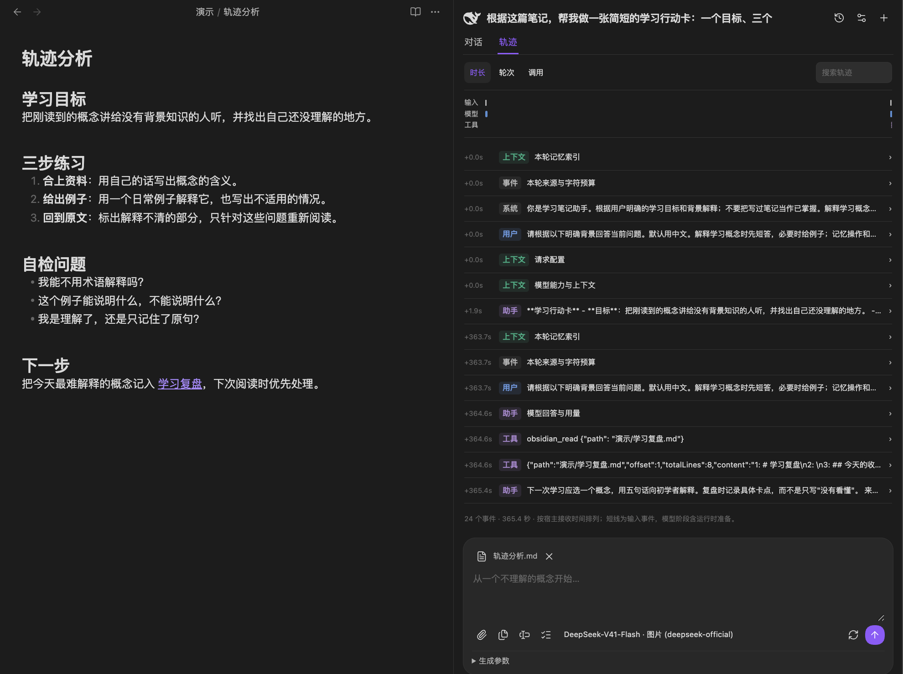
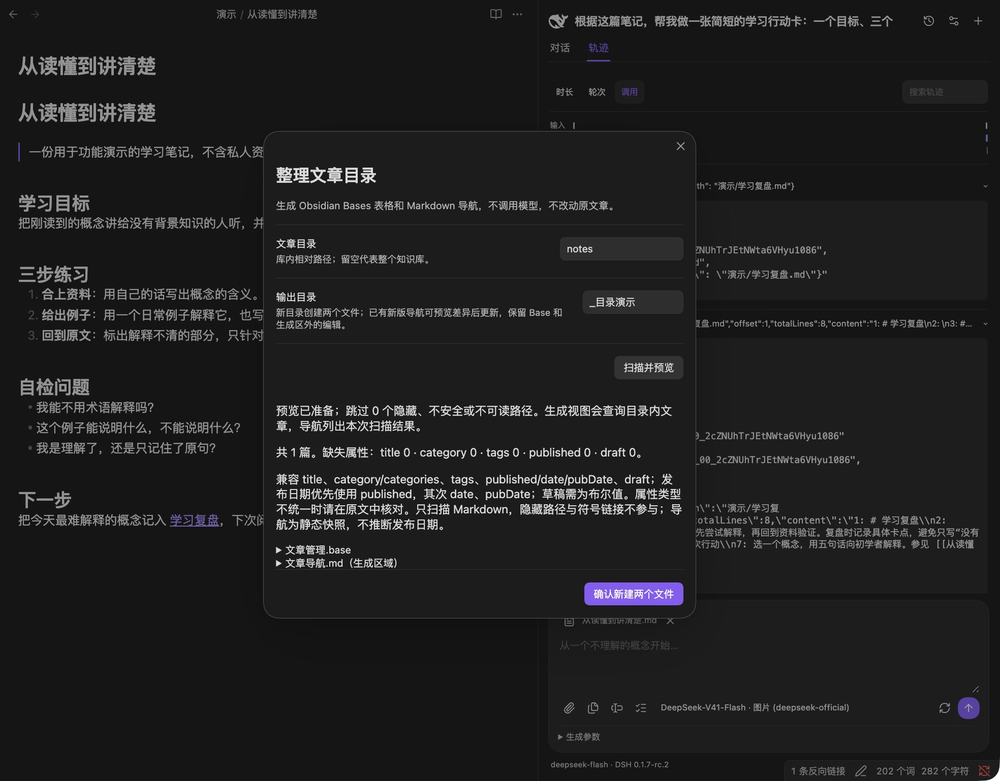

# Feature walkthrough

**English** | [简体中文](DEMO.zh-CN.md) · [Back to README](../README.md)

These screenshots show version **0.7.1** running in desktop **Obsidian 1.13.7 on macOS** on September 26, 2026. They use dedicated synthetic notes and real `deepseek-official / deepseek-flash` responses. They are examples, not a promise of identical output or response time. The interface is currently primarily Chinese.

## Prepare the demo

Complete the [installation steps](../README.md#quick-start). Copy the contents of [demo-notes](demo-notes) into a separate test vault, preserving the `演示/` and `notes/` folders. Do not copy any `.obsidian` directory or credentials. Model requests can incur provider charges; context previews, forks, and catalogs do not themselves call a model.

## 1. Turn a note into an action card

Open [从读懂到讲清楚](demo-notes/演示/从读懂到讲清楚.md), select the note text in the Markdown editor, and choose **向 Deepseedian 提问**. Review **查看下次发送的上下文** before sending. An ordinary current-note snapshot contains text near the cursor, not necessarily the whole document; select the intended passage when you need a specific scope.

Try the prompt used in the screenshot:

> 根据这篇笔记，帮我做一张简短的学习行动卡：一个目标、三个步骤、一个自检问题。只使用当前笔记，不调用工具或保存记忆。

The response contains a goal, three steps, and a self-check question derived from the note. The editor remains unchanged. The footer shows provider-reported token usage and cache information.

## 2. Inspect what will be sent

Open **查看下次发送的上下文** and expand the note entry. Check the path, selected or nearby text, history count, and memory setting. You can stop attaching the current note or change this session's memory-reading permission here.

This is a preview, not a complete replay of every model input. Removing a source does not erase it from previously sent history. The screenshot below shows a later, cursor-local snapshot, which is smaller than the full-note selection used for the action card.

## 3. Explore a different direction with a fork

Under a completed answer, choose **分支到新聊天**. The new chat inherits history through that answer and displays its origin and **返回原对话**. Ask a different follow-up in the branch when needed.

Creating a fork makes no model request. Follow-up messages use the selected provider. Notes and vault memory remain shared; forks do not automatically merge or return conclusions. Restoring the fork after an Obsidian reload was verified separately during this acceptance run.

Unreleased change: newly created branches use numbered title suffixes such as `Title（1）` and `Title（2）`, including forks of a branch. Existing titles are preserved; the screenshot below records the released 0.7.1 format.

## 4. Inspect a real tool call

In the parent conversation, send:

> 请只通过只读笔记工具读取「演示/学习复盘.md」，用两句话说明下一次学习应做什么，并给出笔记引用。不要联网，也不要写入记忆或修改文件。

Open **轨迹**, choose **调用**, and expand the tool request and result. This run called `obsidian_read` on the demo note and returned its numbered lines; the final answer cited that note. **时长** and **轮次** provide alternative views, and the search box filters events.

The timeline uses host reception times. Its total span can include idle time between messages and is not the latency of a single response. Tool results help explain where an answer came from; they do not guarantee that its interpretation is correct.

## 5. Preview a local article catalog

Run `/catalog` or the **整理文章目录** command. Set the source to `notes`, choose a new output directory such as `_目录演示`, then select **扫描并预览**. The included note has the supported article properties, so the screenshot reports one article with no missing properties.

Expand the proposed Base and navigation text if desired. **确认新建两个文件** writes `文章管理.base` and `文章导航.md`; simply closing the preview creates nothing. Open the Base with Obsidian's Bases core plugin enabled. The process runs locally and preserves the original articles.

## 6. Try manual completion

This feature is off by default and uses paid `deepseek-official / deepseek-flash` independently of the chat model. Enable it in plugin settings, put the cursor in a Markdown prose passage, and run **请求当前位置补全**. Press **Tab** to accept or **Esc** to dismiss; accepting is a separate undo step.

No new completion screenshot or completion-quality claim is included in this documentation refresh. See the [completion guide](TAB-COMPLETION.md) and [recorded successes and failures](VALIDATION-0.7.0.md) for its boundaries.

## Evidence and installation status

The [0.7.1 acceptance report](VALIDATION-0.7.1.md) records fresh public-Release installation, real-provider checks, fork restoration, and local catalog generation. Community web publication is confirmed; installation through the client marketplace remained unverified because the plugin was not discoverable during the check.
