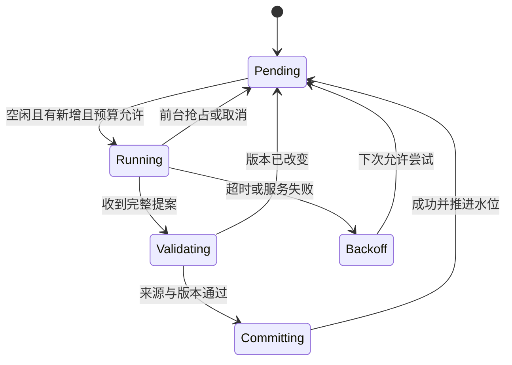

# 同库长期记忆技术设计

状态：设计完成，待实现。基线：Deepsidian 0.3.2 / DSH 0.1.5-rc.2。日期：2026-09-13。

本文是后续实现的接口与验收依据；产品调研见 [Roadmap](RESEARCH-ROADMAP.md)。不表示当前已创建记忆、注册工具或启动后台任务。采用 Claude 风格的 Markdown 记忆、短索引和按需读取，具体事务与调度设计由本项目定义。

## 1. 首版行为与边界

同一库内的聊天可使用共同记忆，其他库不能访问。普通笔记是知识来源；记忆保存用户明确偏好、主题进展、重要决定与来源，不复制整个知识库。规则编辑和管理入口放在设置/命令面板，侧栏继续只负责对话与已有轨迹。

默认建议：记忆读取开启；允许显式“记住/更正/忘记”；自动提炼和闲时模型整理关闭，可在设置中启用。未启用自动提炼时，用户说“记住”仍可保存。两个独立的聊天开关控制 useMemory 与 contributeMemory；临时聊天同时关闭二者。显式关闭 contributeMemory 后的“记住”应提示该聊天不参与记录，并让用户主动改变开关，不能偷偷绕过。

硬边界：本库路径、文件大小、写入事务、预算由宿主代码校验。RULES.md 负责语义判断，不能改变这些边界。模型返回的记忆提案不直接写磁盘。

## 2. 文件与数据格式

按当前 adapter.configDir 和实际插件目录定位，不硬编码 `.obsidian`。首次使用记忆或打开记忆设置才创建目录；普通插件加载不扫描主题文件。

```text
<plugin-dir>/memory/
  RULES.md                  # 用户编辑，整理器只读
  MEMORY.md                 # 短索引，生成视图，不是第二份事实存储
  topics/<topic-id>.md      # 记忆正文的权威来源
  state.json                # 版本、库 ID、水位、排除、预算账本
  journal.jsonl             # 提交结果与限期撤销记录
  .transactions/<tx-id>/    # 提交前日志及暂存内容；恢复后清理
```

首版每条记忆是主题文件中一个带稳定 ID 的块。偏好也放在主题文件（如 preferences.md）；MEMORY.md 从有效条目生成简短摘要/索引，只包含来源条目 ID。直接修改 MEMORY.md 时将其标为需检查，不能静默覆盖：管理页提供“导入为条目”或“重建索引”；编辑正式记忆应跳到对应主题条目。

示例（合成数据）：

````markdown
---
schema: deepsidian-memory-topic-v1
topicId: agent-runtime
title: Agent 运行时
---

## 解释偏好
<!-- deepsidian-memory {"id":"m_example","kind":"preference","status":"active","evidence":"user-explicit","locked":false,"sources":[{"sessionId":"s_example","endSeq":42}],"supersedes":[]} -->
用户熟悉前端，希望首次出现的 agent 术语配简短解释。
````

元数据只接受固定 schema 的单行 JSON 标记，正文到下一条标记所属标题之前结束。解析器不把正文内任意 JSON/代码块当标记；拒绝重复 ID、未知 schema、非法状态和无法唯一划分的块。文件级 frontmatter 使用受限 schema。解析失败时该文件进入只读诊断状态，不清空或“修复”用户文字。实现前以代码围栏、标题、中文和多行正文样例确定解析边界。

条目类型：preference / goal / decision / open-question / finding。状态：active / candidate / contested / resolved / superseded。删除通过宿主执行，移除正文并记录 tombstone；不用在普通主题文件里长期保存已删除正文。

人工通过管理页修改默认 locked=true；检测到外部编辑也将受影响条目锁定，并保留可选“允许自动更新”。模型不能设置 locked=false。规则永不自动修改。mtime 仅用于发现变化，内容 hash 用于版本校验。

初始硬限制（实现配置，不宣称性能测量结果）：单条正文 2000 字符、单文件 128 KiB、全套记忆扫描 4 MiB、搜索返回 5 项、工具读取最多 12000 字符。MEMORY.md 使用完整条目边界裁剪，目标 1000 token、最多 6000 字符；无可靠 tokenizer 时使用保守字符限制并标记 token 为估计。超过范围显示覆盖情况，不能把未扫描称为不存在。

## 3. 宿主接口与模块分工

新增代码规划在 src/plugin/memory/，不扩充一个全能 main.ts。

| 模块 | 职责 |
| --- | --- |
| schema.ts / markdown.ts | 数据校验、条目解析/序列化；纯函数 |
| store.ts | 本库路径、锁、事务、恢复、文件 hash、遗忘 |
| retrieval.ts | 关键词/主题匹配、状态过滤、固定排序、预算 |
| session-context.ts | 新会话索引快照、已读 ID/revision、追加更正 |
| proposals.ts | 提案校验、冲突分类、锁定保护、来源授权 |
| organizer.ts | 增量读取持久日志、调用隔离模型任务、验证提交 |
| scheduler.ts | 空闲条件、前台抢占、重试和预算，不含提炼提示词 |
| settings-view.ts | 规则编辑、条目管理、立即整理、失败诊断 |

拟议 TypeScript 契约（示意，后续代码须定义每个引用类型）：

```ts
interface MemoryOperationContext {
  vaultId: string;
  taskId: string;
  kind: 'foreground' | 'organizer' | 'user-edit';
  signal: AbortSignal;
}
interface MemoryStore {
  snapshot(ctx: MemoryOperationContext): Promise<MemorySnapshot>;
  search(ctx: MemoryOperationContext, query: string): Promise<MemoryHit[]>;
  read(ctx: MemoryOperationContext, ids: string[]): Promise<MemoryEntry[]>;
  commit(ctx: MemoryOperationContext, proposal: MemoryProposal): Promise<CommitResult>;
  forget(ctx: MemoryOperationContext, ids: string[]): Promise<CommitResult>;
}
```

上下文 taskId/vaultId/权限由宿主创建，不能信任模型传来的同名参数。模型工具只收 query、ids、候选正文和来源引用。每个工具返回有界结果与版本、覆盖范围、错误代码；模型不能指定绝对路径。与普通笔记 safeNotePath 分开校验隐藏记忆目录，不能放宽所有笔记工具的路径限制。

前台工具：memory_search、memory_read、memory_propose。提交/遗忘由宿主操作或经验证的显式用户动作完成；“只要模型说用户要求了”不构成写入依据。自动提炼开启时，宿主仅允许 organizer 对其授权来源生成 active/candidate 提案。无新增来源的去重整理可处理已存在条目，但不能制造新的用户偏好证据。

M0/M1 的最低可用写入入口是命令面板或管理页对选中文本“记住”，可确切记录用户授权；自然语言“记住”映射在集成阶段实现，不用简单全文关键词命中决定授权。撤销删除或重新允许同一来源须显式用户操作。

## 4. 与当前 DSH 桥接集成

现状：main.ask 组装文本后调用 DshClient.prompt；bridge.mjs 负责 create/resume 和 followup。main.handleTool 依赖全局 busy，不能直接供后台整理调用；UI trace 有截断，不是可靠的提炼输入。

协议升级须增加 capability 协商，新增请求字段保持可选。旧桥不支持 memoryContext 时禁用记忆并给诊断，不静默宣称已经注入。

- 首次请求：宿主冻结索引快照，赋予 snapshotId 和 requestId。桥接在此轮用户消息中加入独立标记的记忆资料块，与问题一起进入 DSH 持久日志，避免“注入成功但问题失败”形成游离记录。
- 恢复：以 DSH 日志中已提交的 snapshotId 为准；宿主 data.json 里的 seen 集合只是缓存。重启后不重放已发送的索引；查不清时先重建状态，不凭 UI 消息数猜测。
- 工具读取：返回条目内容/来源/revision，正常工具结果进入历史；记录哪些条目已暴露，以便后续更正。
- 新版本：未暴露条目不用通知当前会话。已经暴露且相关的条目被更正/遗忘时，在下一次用户请求中追加撤回或更正；不改早期消息。
- snapshotId/全局 revision 不每轮放在稳定系统提示里。规则只随整理任务传入，不随普通聊天全文重复发送。

序列号、requestId 幂等与持久确认是集成验证点：DSH 接收后宿主崩溃，再试同一 requestId 不得产生重复问题或索引。先验证已安装 DSH 提供的 message id / durable lookup 行为；如不能建立可靠去重，M1 暂不支持中断自动重试，显示“已提交状态待核对”，由恢复流程确认后再发。不能先在宿主标记成功再假定 DSH 已落盘。

## 5. 整理提案与事务

提案包含 proposalId、规则 hash、源批次 ID、基准文件 hash、增删改操作及每项 sourceRefs。宿主校验格式、来源属于授权批次、去重、locked、tombstone、状态变化和总大小。冲突提案不能部分静默落地；重新读取后重算或交用户处理。

原子 rename 只能保护一个文件，多文件不能假装天然原子：

1. 获取本机写锁，暂停新读快照，重新校验所有基准 hash。
2. 在 .transactions 中写入 tx manifest、前镜像和后镜像并持久化；再记录 prepared。
3. 逐个文件替换，最后更新 state 的 committed transactionId 和整理水位。
4. 记录 committed，释放读闸门。journal 可由事务补齐，索引可重建。

崩溃恢复在开放记忆读写前运行：文件符合前/后镜像则完成提交或回滚；出现第三种内容说明有人或同步程序编辑过，暂停自动恢复并保留文件待处理。不给主聊天制造启动失败：记忆不可用时仍可正常聊天，但必须显示可检查的诊断。

首版仅支持本机单写者。锁残留不能只看超时便删除；需确认原进程不再持锁。跨设备 Obsidian Sync 并发不在首版承诺范围，检测到冲突副本/不一致 manifest 暂停自动写。外部编辑在最后校验与写入间仍有竞态，保留前镜像并明确限制，不能宣称任意同步软件下无丢失。

遗忘记录包含 ID、来源区间和规范化文本 hash，不含原文；hash 不是匿名保证。阻止旧来源再次提炼，不阻止用户未来明确重新提供该事实。仅通过字面 hash 无法阻止所有改写复活，因此同时排除原来源区间，必要时将该会话设为不贡献。撤销记录默认保留 7 天，可配置立即清理；历史聊天与已发请求另外管理，不将“停止召回”说成删除一切历史副本。

## 6. 闲时整理

先做同一 organizer 的手动触发，再加 scheduler。读取真实 DSH 完成轮次及原用户/工具来源类型；用户输入里的引文仍是资料，不自动视为用户自身偏好。附件二进制与完整网页不进入摘要批次，只有必要有界内容。密钥过滤是防护，不保证任意敏感信息都能识别。

自动触发初值：用户交互与前台结束均已过去 10 分钟，有新增未处理轮次，距离上次自动尝试至少 6 小时。手动触发可跳过等待，仍服从权限/预算。每批最多 20 轮；输入按模型上下文和输出预留进一步裁剪，不能只按轮数限制。过大的单轮保留可追踪的裁剪信息，不推进未处理片段的水位。



后台使用独立 DshClient/任务会话，composition 不挂载终端、网页、笔记写入和前台记忆工具；读取授权数据由宿主准备，模型只输出提案。不可复用主 client.active，因为其单请求状态会被覆盖。前台到来先取消后台，设置有界停止期限，超时终止后台专属进程；不得因后台无法退出而无限延迟前台。提交中的短事务先完成或恢复，不在半写处强杀宿主。

每日预算分输入/输出 token 与批次数。启动前预留上界，结束按 usage 结算；usage 缺失时保留预留额，不以零成本记账。时钟回拨不能重置预算，按持久化周期与单调计时处理本次进程时间。休眠恢复最多执行一批，插件关闭后不运行系统级定时任务；重新打开从水位继续。错误指数退避，持续失败进入设置诊断，不反复通知用户。

## 7. 交互与迁移

设置入口：记忆总开关、自动整理、规则编辑、管理条目、立即整理、预算及覆盖目录。编辑 RULES.md 时提供默认模板和恢复默认；恢复操作只改规则，不清空记忆。管理页支持来源跳转、编辑/锁定、忘记、查看最近整理结果。隐藏目录通过插件编辑弹窗操作，不能依赖普通库文件浏览器。

首次开启不扫描全部历史：默认从开启时刻后产生的完成轮次开始。旧聊天可由用户选择回填，显示范围与预算；旧 background 只提供可选导入预览。普通聊天的回答失败/取消仍有持久证据，但首版只提炼明确完成的轮次，不将中断输出当稳定结论。

自动成功不在侧栏加卡片；“记住/忘记”的显式操作有简短回执。实际索引与召回内容进入现有轨迹。新规则适用于下一次整理，不自动重写所有旧记忆；用户可手动运行规则复审，作为独立有预算任务。

## 8. 实施与验收清单

| 切片 | 交付 | 必过样例 |
| --- | --- | --- |
| M0 文件与规则 | schema、解析器、store、事务恢复、规则编辑、管理页 | 中文/代码围栏解析；坏格式不丢数据；中途崩溃恢复；重复 ID/路径逃逸拒绝；编辑冲突保护 |
| M1 同库召回 | 显式记住/更正/遗忘、索引快照、search/read、协议能力 | A 记住 B 召回；其他库不召回；恢复不重复注入；更正影响新请求；删除重启不复活；不加载所有主题 |
| M2 手动整理 | 授权来源批次、提案校验、去重/冲突/锁定 | 同批重跑幂等；模型推测保留 candidate；用户锁定不覆盖；引文指令不改规则；预算不足不启动 |
| M3 闲时整理 | 调度、独立 client、取消、额度账本、退避 | 前台抢占；睡眠恢复不连跑；无新增零请求；缺失 usage 保守结算；关闭插件后无进程；提交后才推进水位 |

先用合成对话和本地模型服务验收，不读取真实库做自动提炼实验。真实 provider 小样例测额外 token、首字延迟、误用偏好率与缓存 hit/miss；用户问题不应因一次记忆检索故障失败。此轮仅设计，不把未执行的样例标为通过。

首个实现任务应是 M0：冻结解析样例、完成存储与规则编辑，再提交独立检查。DSH 协议去重/恢复不确定性在 M1 前完成小实验，不能让前端先假定可靠。公共产品说明不包含本地个人日志；开发学习记录留在专用笔记库。
