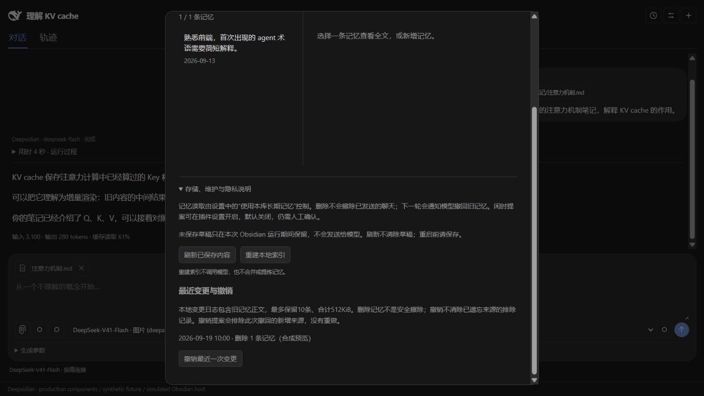
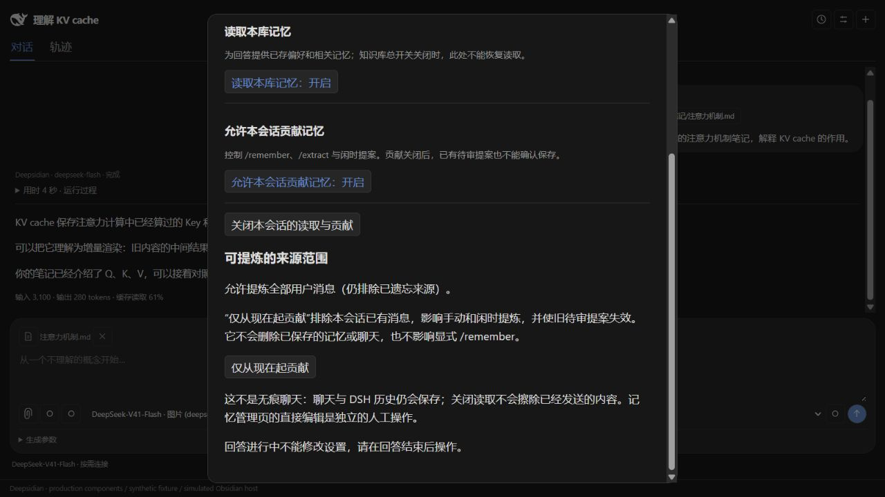
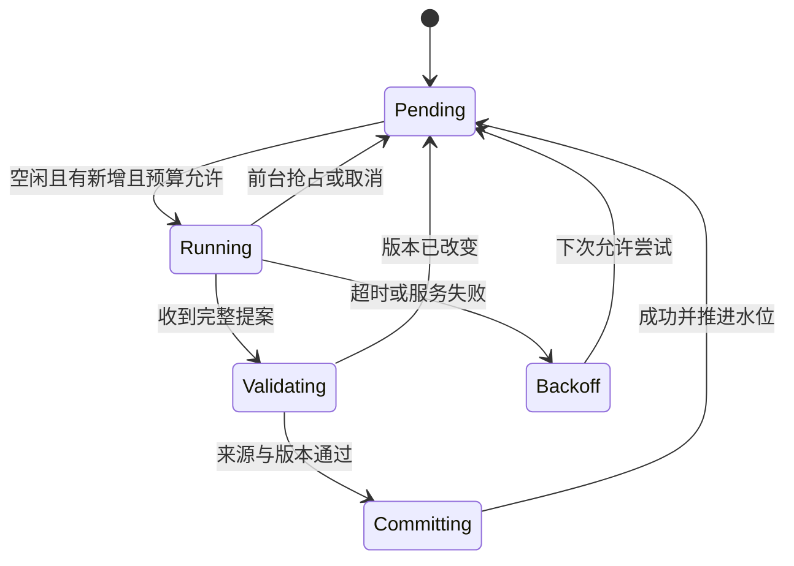

# 同库长期记忆技术设计

## 当前版本：记忆 v1 功能闭环（2026-09-19，插件 0.6.0）

这是当前实现的权威摘要。下方按日期保留的阶段记录及目标设计不表示仍然缺少已交付功能，也不表示全部远期设计已实现。

本库保存/读取、更正删除、人工提炼审批、闲时待审生成、来源范围与撤销恢复已形成闭环。新增默认关闭的“允许 AI 管理记忆”：开启后，当前用户明确要求可由聊天模型通过 `memory_manage` 直接提交，不必调用 `/extract`。记忆由插件管理，DSH 提供模型运行和会话历史，不依赖其 Web profile 的记忆插件。

### 自然语言管理边界

- 工具只在开关开启的前台运行时注册；独立提炼器不注册。全局/会话读取关闭或会话不贡献时宿主仍拒绝写入。切换管理开关需先结束回答，持久化成功后生效并重建工具配置。
- 一轮一个 `MemoryManager`，只接受当前用户消息的逐字引用；来源哈希绑定会话、消息位置和全文。解释是否为明确意图由模型负责，引用匹配不是语义证明。规则文件目前控制提炼器的整理偏好，不是前台直接管理的权限策略；前台遵守内置工具规则和当前明确要求。
- 新增、更正使用同一存储事务和来源记录；遗忘排除已有来源。模型不能借此修改规则、任意文件或其他库。每轮最多5次变更，最近一次成功的相同参数重试复用结果；不是跨轮或任意乱序调用的全局幂等。
- 提交前检查当前manager身份、权限、取消状态和原消息。检查放在事务最后一次异步文件核对之后；事务发布一旦开始便完成恢复流程，停止回答不回滚已经提交的变更。
- `store.update` 在同一个写锁内返回提交快照，供当前轮后续读取；不另行读取并吸收并发编辑。外部更改令后续写入版本冲突，不能自动覆盖。
- 工具返回成功才表示已保存。界面有通知和轨迹，撤销复用 `/memory` 维护页；不会额外自动弹审批窗口。闲时提案仍须人工确认。

- `store.history()` 返回摘要和可撤销状态；`undo(revision, {restoreDeleted})` 只撤销最近一次操作，不支持连续撤销/重做。恢复删除必须确认。提案撤销会排除撤回的新来源，保留旧来源；已排除来源不会因恢复正文而重新获得提炼许可。
- `journal.json` 与正式文件同一写前事务保存，最多10条、512KiB，超限淘汰最旧记录。它包含旧正文和规则，所以删除不是安全擦除；恢复使用当前revision并核对正文指纹，遇到外部编辑拒绝覆盖。
- 写锁记录主机名/PID/token。所有新写入者先经过短暂恢复guard；只有同主机且进程明确不存在的锁可自动移除。活动、未知、旧格式、其他主机锁和异常遗留guard均不自动删除，需人工核实；不假设PID探测能证明跨机器进程死亡。仍不提供断电级fsync保证。
- `/memory` → 本会话 → “仅从现在起贡献”：保存消息边界和整个已排除前缀的hash。手动、闲时和确认阶段共用校验。前缀被编辑/删除时停止提炼，要求重新设起点。恢复全部需确认；改变策略清除该会话待审/游标，策略版本使旧手动提案失效。显式 `/remember` 不受这个历史范围限制，但仍受贡献开关控制。
- 提炼提示词明确区分用户本人和虚构人物、引用、第三人称。逐字引用校验只能证明原文存在，不能证明语义归属正确，因此仍须人工审批。
- 每轮撤回旧记忆，新增约束：未要求查看历史时，不主动复述已更正或删除的内容。历史仍保留在DSH中；这不是模型上下文物理擦除。

验证：0.6累计89个离线测试通过、1项Windows符号链接权限跳过；8项真实DSH＋本地模拟模型集成全通过（含0.1.5-rc.2→0.1.6-alpha.2迁移）；既有9项真实Modal控件/模拟宿主浏览器断言在前轮通过，本轮未重复该UI验收。DeepSeek官方 `deepseek-flash` 付费合成验收覆盖跨会话、更正、重启、删除，以及提炼正例/虚构负例。先记录旧值复述失败，再修改规则复验通过；并非只保存成功结果。

边界与后续：没有语义向量检索、多主题按需磁盘加载、完整历史清除、跨机器共享预算或连续撤销。用户已反馈此前要求的原生验收完成；本轮新增管理工具另做宿主回归、桥接集成和官方付费模型验收。0.6表示当前记忆v1范围完成，不表示所有远期设想或所有平台均已验证。




截图为生产Modal组件、合成数据与模拟Obsidian宿主，展示滚动后的操作区。

## 0.5.0 当前实现（2026-09-16）

最新增量：M3闲时待审提案基础实现已完成，默认关闭。以下M1/M2及历史段落保留阶段记录，M3实际行为以本节为准。

### M3 闲时调度与恢复

`memory/scheduler.ts` 独立调度器通过宿主回调读会话、读记忆、调用隔离整理器和排队持久化。不开启时不读记忆、不启动模型。布局恢复后定时检查；主窗口及已打开/新开的弹出窗口键鼠活动更新5分钟空闲阈值并取消后台任务，插件卸载清理监听并禁止迟到布局回调重挂。

后台任务不占聊天busy；新提问可以立即开始。手动提炼复用同一整理运行目录，因此会先取消并等待后台进程退出。调度器只允许一个在途任务和一个持久待审批次，待审未处理时停止自动模型调用。

data.json的idleMemory保存version、UTC日期、calls/chars预算、retryAt、按会话的cursor（最后处理的消息index/key）、pending（id及完整ProposalBatch）和状态提示。生成前通过saveChange预留每日2任务/80000输入字符额度，写失败不调用模型；单任务沿用4096输出token、40000输入字符和5分钟运行超时。预留成功即计费预算，取消/失败不退额度；它是任务/字符上限，不保证供应商金额或DSH内部重试的请求次数。多个独立插件进程共享预算未实现跨进程互斥。

从每个允许贡献会话的cursor之后取最多20条未排除用户消息；超限从批次末尾减少完整消息，单条仍超限则尝试其他会话，不跳过该会话进度。有效空结果也推进cursor。有候选时cursor与pending一起持久化，持久化失败不推进；重启后保留预留预算与至少10分钟的重试时间。旧cursor锚点不匹配时从该会话开头重新检查，尚无稳定消息ID或完整历史编辑日志。

人工确认仍复用M2的权限、来源与revision复验。确认/放弃互斥；成功保存所选项后清理pending，未选中项被丢弃。memory事务和data.json不是跨文件原子事务；若记忆已保存而待审清理失败，明确提示仅放弃旧批次，revision阻止重复应用。关闭待审窗口保留数据，普通手动提炼窗口关闭仍丢弃临时提案。

前台抢占主要取消生成阶段；已经进入持久化的结果不承诺回滚。待审批次包含规则、旧记忆和来源副本，删除正式记忆不等于擦除这些副本，需同时放弃待审批次及另行管理聊天/运行日志。

验证：59个离线测试通过、1个Windows符号链接权限跳过，5个真实DSH＋本地模拟模型集成通过。测试覆盖预算预留/重启、取消不推进、水位/待审恢复、长批缩减、窗口活动、卸载清理、确认/放弃竞态。浏览器核验使用模拟Obsidian宿主，未完成原生Obsidian实机闲时验收。

尚需完成的记忆系统收尾：journal/撤销、异常锁恢复、来源时间区间权限、更强遗忘/历史管理、真实模型质量与长时间实机验证。保持0.5.x，不将M3基础交付声称为完整记忆系统验收。

M1基础闭环已落地：每次发送时冻结当前库 MemorySnapshot，最多12条160字符摘要进入本轮用户消息；memory_search最多返回8条摘要，可offset分页，memory_read只接受当前快照的条目ID；每轮工具输出累计24000字符，初始上下文仍受40000字符限制。关闭useMemory时不访问存储，并通知模型停用旧长期记忆。

与早期目标设计的差异：当前每轮追加短索引并撤回全部旧记忆引用，没有“一次注入＋按曝光ID增量撤回”的持久化ledger。这样无需假设DSH消息确认与宿主曝光状态原子提交，代价是每轮多带短索引。历史前缀不重写，但不能保证供应商缓存命中。先按词匹配排序（英文词、中文重叠二元词组），没有语义检索。读全体本地条目后筛选，不是按主题延迟磁盘读取。

记忆修改在下一轮生效，生成中的工具仍读该轮冻结快照。删除不擦除DSH历史/已存聊天：每轮明确撤回旧快照，模型仍可能从历史回答推断出旧偏好；严格清除历史需另行设计会话重建。当前显式记住仍通过 /remember 或管理窗口；普通“请记住”不会自动写入。读取由知识库总开关与会话开关共同控制；已增加会话贡献开关（当前拦截 /remember），来源区间遗忘和中断自动重试尚未实现。

轨迹分开记录 memory/snapshot（提供的摘要）、memory/search、memory/read（实际返回条目），不把提供索引声称为模型已采用偏好。读取失败或超预算会在提交前停止，保留输入草稿。RULES用于 /extract 手动模型提炼，普通问答不加载它。

M2手动模型提案基础流程已实现，详见下节；M3闲时整理仍待实现。以下0.4.0记录和完整目标设计作为历史/后续参考，以本节为当前实现状态。


## M2 手动模型提案增量（2026-09-16，仍为 0.5.0）

入口 `/extract`、记忆窗口或设置的“从会话提炼”。选择会话，展示候选来源，点击生成才发起模型调用；先取最近20条非空用户消息，再排除已遗忘来源，不向前补齐。仅使用消息正文，不附上助手回答、笔记选区或附件。所有已有记忆正文与 RULES 一起进入输入，总计最多40000字符；超限停止，不静默裁剪。贡献关闭的会话不能生成或确认。

`proposals.ts` 负责来源SHA-256标识（会话ID、消息下标、原文）、输入预算与JSON校验。每次最多12项 add/edit；正文2000字符、理由500字符、每项1–3处500字符以内的逐字引用。宿主验证引用确实属于授权来源，拒绝未知更正ID、重复目标、完全相同正文及非法标记。不对语义真实性作保证，模型理由和原文由人核对。没有自动语义合并；旧记忆的更正须单独勾选覆盖，未实现自动锁定等级。

`organizer.ts` 使用独立DSH进程和随机会话ID，配置当前模型、4096输出token上限、无Web与Obsidian工具；不复用主聊天历史。继承DshClient的5分钟超时。取消、关窗、卸载停止独立进程，初始化结束后再次检查取消。提案只在窗口内存保留，模型请求/结果可能存于插件 `.memory-runtime`，取消不删除日志或供应商已收到的数据。

`organizer-modal.ts` 展示新增正文、更正前后、原因、来源消息编号和原文引用。默认均不勾选；确认只提交所选项。宿主再次验证贡献权限、消息hash、记忆/规则revision，存储层在锁内校验并通过同一恢复事务提交整批。版本或来源变更要求重新生成，不在旧提案上盲目重试。提交成功隐藏确认按钮防重复提交；这不是跨崩溃的请求幂等账本。

条目新增可选sourceKeys；旧文件兼容。更正合并历史来源标识；删除把这些标识记入state.excludedSources，之后提炼排除整个原消息，包含同消息内其他事实。这是保守的消息级排除，不是语义永久遗忘：另一条消息表达相同事实仍可能再次提出，手动条目若无sourceKeys也没有历史来源排除。聊天、日志和供应商副本不擦除。`/organize` 继续只做本地索引重建。

尚未交付：M3闲时调度/预算账本/前台抢占、水位和增量批次、来源时间区间权限、提案持久化、日志撤销、自动锁恢复、严格历史清除及真实模型记忆质量评估。记忆系统完成前不升级0.6+。

以下为历史记录：状态：0.4.0 已实现 M0 的基础存储和编辑入口；M1–M3 仍待实现。DSH 验证基线 0.1.5-rc.2。日期：2026-09-13。

## 0.4.0 落地范围与设计差异

- `memory/store.ts` 使用单个 `topics/general.md` 保存带稳定 ID 的正文，规则在 RULES.md，索引在 MEMORY.md；state.json 保留库 ID 和删除 ID。
- 管理页支持新增、编辑、确认删除、规则保存；`/remember` 为显式保存入口，`/organize` 仅重建本地索引，不调用模型、不合并语义。
- 通过内容 revision 阻止过期写入；transaction.json 保存前/后镜像，可恢复已准备事务，遇到外部编辑暂停。当前未提供 journal 撤销或断电级 fsync 保证。
- writer.lock 防止多个实例同时写入；异常退出遗留锁不会自动删除，需确认无其他实例写入后手动移除，之后会检查事务恢复。测试覆盖已准备事务的恢复，不等于完整自动崩溃恢复体验已经完成。
- 当前没有来源 seq 提取、来源区间遗忘、模型提案、自动召回和闲时调度。删除 ID 只能服务现有手动存储，不能声称已解决未来历史提炼的全部遗忘语义。
- Markdown 格式为 `# 本库记忆` 加起止标记块；单个主题 128 KiB、最多 500 条、单条 2000 字符。索引最多列 50 条。索引是派生文件，当前本地整理会重建它，正式内容应在管理页编辑。

以下为完整目标设计；与当前实现有差异时，以本节和 README 的实际功能说明为准。

本文是后续实现的接口与验收依据；产品调研见 [Roadmap](RESEARCH-ROADMAP.md)。不表示当前已创建记忆、注册工具或启动后台任务。采用 Claude 风格的 Markdown 记忆、短索引和按需读取，具体事务与调度设计由本项目定义。

## 1. 首版行为与边界

同一库内的聊天可使用共同记忆，其他库不能访问。普通笔记是知识来源；记忆保存用户明确偏好、主题进展、重要决定与来源，不复制整个知识库。规则编辑和管理入口放在设置/命令面板，侧栏继续只负责对话与已有轨迹。

默认建议：记忆读取开启；允许显式“记住/更正/忘记”；自动提炼和闲时模型整理关闭，可在设置中启用。未启用自动提炼时，用户说“记住”仍可保存。两个独立的聊天开关控制 useMemory 与 contributeMemory；临时聊天同时关闭二者。显式关闭 contributeMemory 后的“记住”应提示该聊天不参与记录，并让用户主动改变开关，不能偷偷绕过。

硬边界：本库路径、文件大小、写入事务、预算由宿主代码校验。RULES.md 负责语义判断，不能改变这些边界。模型返回的记忆提案不直接写磁盘。

## 2. 文件与数据格式

按当前 adapter.configDir 和实际插件目录定位，不硬编码 `.obsidian`。首次使用记忆或打开记忆设置才创建目录；普通插件加载不扫描主题文件。

```text
<plugin-dir>/memory/
  RULES.md                  # 用户编辑，整理器只读
  MEMORY.md                 # 短索引，生成视图，不是第二份事实存储
  topics/<topic-id>.md      # 记忆正文的权威来源
  state.json                # 版本、库 ID、水位、排除、预算账本
  journal.jsonl             # 提交结果与限期撤销记录
  .transactions/<tx-id>/    # 提交前日志及暂存内容；恢复后清理
```

首版每条记忆是主题文件中一个带稳定 ID 的块。偏好也放在主题文件（如 preferences.md）；MEMORY.md 从有效条目生成简短摘要/索引，只包含来源条目 ID。直接修改 MEMORY.md 时将其标为需检查，不能静默覆盖：管理页提供“导入为条目”或“重建索引”；编辑正式记忆应跳到对应主题条目。

示例（合成数据）：

````markdown
---
schema: deepsidian-memory-topic-v1
topicId: agent-runtime
title: Agent 运行时
---

## 解释偏好
<!-- deepsidian-memory {"id":"m_example","kind":"preference","status":"active","evidence":"user-explicit","locked":false,"sources":[{"sessionId":"s_example","endSeq":42}],"supersedes":[]} -->
用户熟悉前端，希望首次出现的 agent 术语配简短解释。
````

元数据只接受固定 schema 的单行 JSON 标记，正文到下一条标记所属标题之前结束。解析器不把正文内任意 JSON/代码块当标记；拒绝重复 ID、未知 schema、非法状态和无法唯一划分的块。文件级 frontmatter 使用受限 schema。解析失败时该文件进入只读诊断状态，不清空或“修复”用户文字。实现前以代码围栏、标题、中文和多行正文样例确定解析边界。

条目类型：preference / goal / decision / open-question / finding。状态：active / candidate / contested / resolved / superseded。删除通过宿主执行，移除正文并记录 tombstone；不用在普通主题文件里长期保存已删除正文。

人工通过管理页修改默认 locked=true；检测到外部编辑也将受影响条目锁定，并保留可选“允许自动更新”。模型不能设置 locked=false。规则永不自动修改。mtime 仅用于发现变化，内容 hash 用于版本校验。

初始硬限制（实现配置，不宣称性能测量结果）：单条正文 2000 字符、单文件 128 KiB、全套记忆扫描 4 MiB、搜索返回 5 项、工具读取最多 12000 字符。MEMORY.md 使用完整条目边界裁剪，目标 1000 token、最多 6000 字符；无可靠 tokenizer 时使用保守字符限制并标记 token 为估计。超过范围显示覆盖情况，不能把未扫描称为不存在。

## 3. 宿主接口与模块分工

新增代码规划在 src/plugin/memory/，不扩充一个全能 main.ts。

| 模块 | 职责 |
| --- | --- |
| schema.ts / markdown.ts | 数据校验、条目解析/序列化；纯函数 |
| store.ts | 本库路径、锁、事务、恢复、文件 hash、遗忘 |
| retrieval.ts | 关键词/主题匹配、状态过滤、固定排序、预算 |
| session-context.ts | 新会话索引快照、已读 ID/revision、追加更正 |
| proposals.ts | 提案校验、冲突分类、锁定保护、来源授权 |
| organizer.ts | 增量读取持久日志、调用隔离模型任务、验证提交 |
| scheduler.ts | 空闲条件、前台抢占、重试和预算，不含提炼提示词 |
| settings-view.ts | 规则编辑、条目管理、立即整理、失败诊断 |

拟议 TypeScript 契约（示意，后续代码须定义每个引用类型）：

```ts
interface MemoryOperationContext {
  vaultId: string;
  taskId: string;
  kind: 'foreground' | 'organizer' | 'user-edit';
  signal: AbortSignal;
}
interface MemoryStore {
  snapshot(ctx: MemoryOperationContext): Promise<MemorySnapshot>;
  search(ctx: MemoryOperationContext, query: string): Promise<MemoryHit[]>;
  read(ctx: MemoryOperationContext, ids: string[]): Promise<MemoryEntry[]>;
  commit(ctx: MemoryOperationContext, proposal: MemoryProposal): Promise<CommitResult>;
  forget(ctx: MemoryOperationContext, ids: string[]): Promise<CommitResult>;
}
```

上下文 taskId/vaultId/权限由宿主创建，不能信任模型传来的同名参数。模型工具只收 query、ids、候选正文和来源引用。每个工具返回有界结果与版本、覆盖范围、错误代码；模型不能指定绝对路径。与普通笔记 safeNotePath 分开校验隐藏记忆目录，不能放宽所有笔记工具的路径限制。

前台工具：memory_search、memory_read、memory_propose。提交/遗忘由宿主操作或经验证的显式用户动作完成；“只要模型说用户要求了”不构成写入依据。自动提炼开启时，宿主仅允许 organizer 对其授权来源生成 active/candidate 提案。无新增来源的去重整理可处理已存在条目，但不能制造新的用户偏好证据。

M0/M1 的最低可用写入入口是命令面板或管理页对选中文本“记住”，可确切记录用户授权；自然语言“记住”映射在集成阶段实现，不用简单全文关键词命中决定授权。撤销删除或重新允许同一来源须显式用户操作。

## 4. 与当前 DSH 桥接集成

现状：main.ask 组装文本后调用 DshClient.prompt；bridge.mjs 负责 create/resume 和 followup。main.handleTool 依赖全局 busy，不能直接供后台整理调用；UI trace 有截断，不是可靠的提炼输入。

协议升级须增加 capability 协商，新增请求字段保持可选。旧桥不支持 memoryContext 时禁用记忆并给诊断，不静默宣称已经注入。

- 首次请求：宿主冻结索引快照，赋予 snapshotId 和 requestId。桥接在此轮用户消息中加入独立标记的记忆资料块，与问题一起进入 DSH 持久日志，避免“注入成功但问题失败”形成游离记录。
- 恢复：以 DSH 日志中已提交的 snapshotId 为准；宿主 data.json 里的 seen 集合只是缓存。重启后不重放已发送的索引；查不清时先重建状态，不凭 UI 消息数猜测。
- 工具读取：返回条目内容/来源/revision，正常工具结果进入历史；记录哪些条目已暴露，以便后续更正。
- 新版本：未暴露条目不用通知当前会话。已经暴露且相关的条目被更正/遗忘时，在下一次用户请求中追加撤回或更正；不改早期消息。
- snapshotId/全局 revision 不每轮放在稳定系统提示里。规则只随整理任务传入，不随普通聊天全文重复发送。

序列号、requestId 幂等与持久确认是集成验证点：DSH 接收后宿主崩溃，再试同一 requestId 不得产生重复问题或索引。先验证已安装 DSH 提供的 message id / durable lookup 行为；如不能建立可靠去重，M1 暂不支持中断自动重试，显示“已提交状态待核对”，由恢复流程确认后再发。不能先在宿主标记成功再假定 DSH 已落盘。

## 5. 整理提案与事务

提案包含 proposalId、规则 hash、源批次 ID、基准文件 hash、增删改操作及每项 sourceRefs。宿主校验格式、来源属于授权批次、去重、locked、tombstone、状态变化和总大小。冲突提案不能部分静默落地；重新读取后重算或交用户处理。

原子 rename 只能保护一个文件，多文件不能假装天然原子：

1. 获取本机写锁，暂停新读快照，重新校验所有基准 hash。
2. 在 .transactions 中写入 tx manifest、前镜像和后镜像并持久化；再记录 prepared。
3. 逐个文件替换，最后更新 state 的 committed transactionId 和整理水位。
4. 记录 committed，释放读闸门。journal 可由事务补齐，索引可重建。

崩溃恢复在开放记忆读写前运行：文件符合前/后镜像则完成提交或回滚；出现第三种内容说明有人或同步程序编辑过，暂停自动恢复并保留文件待处理。不给主聊天制造启动失败：记忆不可用时仍可正常聊天，但必须显示可检查的诊断。

首版仅支持本机单写者。锁残留不能只看超时便删除；需确认原进程不再持锁。跨设备 Obsidian Sync 并发不在首版承诺范围，检测到冲突副本/不一致 manifest 暂停自动写。外部编辑在最后校验与写入间仍有竞态，保留前镜像并明确限制，不能宣称任意同步软件下无丢失。

遗忘记录包含 ID、来源区间和规范化文本 hash，不含原文；hash 不是匿名保证。阻止旧来源再次提炼，不阻止用户未来明确重新提供该事实。仅通过字面 hash 无法阻止所有改写复活，因此同时排除原来源区间，必要时将该会话设为不贡献。撤销记录默认保留 7 天，可配置立即清理；历史聊天与已发请求另外管理，不将“停止召回”说成删除一切历史副本。

## 6. 闲时整理

先做同一 organizer 的手动触发，再加 scheduler。读取真实 DSH 完成轮次及原用户/工具来源类型；用户输入里的引文仍是资料，不自动视为用户自身偏好。附件二进制与完整网页不进入摘要批次，只有必要有界内容。密钥过滤是防护，不保证任意敏感信息都能识别。

自动触发初值：用户交互与前台结束均已过去 10 分钟，有新增未处理轮次，距离上次自动尝试至少 6 小时。手动触发可跳过等待，仍服从权限/预算。每批最多 20 轮；输入按模型上下文和输出预留进一步裁剪，不能只按轮数限制。过大的单轮保留可追踪的裁剪信息，不推进未处理片段的水位。



后台使用独立 DshClient/任务会话，composition 不挂载终端、网页、笔记写入和前台记忆工具；读取授权数据由宿主准备，模型只输出提案。不可复用主 client.active，因为其单请求状态会被覆盖。前台到来先取消后台，设置有界停止期限，超时终止后台专属进程；不得因后台无法退出而无限延迟前台。提交中的短事务先完成或恢复，不在半写处强杀宿主。

每日预算分输入/输出 token 与批次数。启动前预留上界，结束按 usage 结算；usage 缺失时保留预留额，不以零成本记账。时钟回拨不能重置预算，按持久化周期与单调计时处理本次进程时间。休眠恢复最多执行一批，插件关闭后不运行系统级定时任务；重新打开从水位继续。错误指数退避，持续失败进入设置诊断，不反复通知用户。

## 7. 交互与迁移

设置入口：记忆总开关、自动整理、规则编辑、管理条目、立即整理、预算及覆盖目录。编辑 RULES.md 时提供默认模板和恢复默认；恢复操作只改规则，不清空记忆。管理页支持来源跳转、编辑/锁定、忘记、查看最近整理结果。隐藏目录通过插件编辑弹窗操作，不能依赖普通库文件浏览器。

首次开启不扫描全部历史：默认从开启时刻后产生的完成轮次开始。旧聊天可由用户选择回填，显示范围与预算；旧 background 只提供可选导入预览。普通聊天的回答失败/取消仍有持久证据，但首版只提炼明确完成的轮次，不将中断输出当稳定结论。

自动成功不在侧栏加卡片；“记住/忘记”的显式操作有简短回执。实际索引与召回内容进入现有轨迹。新规则适用于下一次整理，不自动重写所有旧记忆；用户可手动运行规则复审，作为独立有预算任务。

## 8. 实施与验收清单

| 切片 | 交付 | 必过样例 |
| --- | --- | --- |
| M0 文件与规则 | schema、解析器、store、事务恢复、规则编辑、管理页 | 中文/代码围栏解析；坏格式不丢数据；中途崩溃恢复；重复 ID/路径逃逸拒绝；编辑冲突保护 |
| M1 同库召回 | 显式记住/更正/遗忘、索引快照、search/read、协议能力 | A 记住 B 召回；其他库不召回；恢复不重复注入；更正影响新请求；删除重启不复活；不加载所有主题 |
| M2 手动整理 | 授权来源批次、提案校验、去重/冲突/锁定 | 同批重跑幂等；模型推测保留 candidate；用户锁定不覆盖；引文指令不改规则；预算不足不启动 |
| M3 闲时整理 | 调度、独立 client、取消、额度账本、退避 | 前台抢占；睡眠恢复不连跑；无新增零请求；缺失 usage 保守结算；关闭插件后无进程；提交后才推进水位 |

先用合成对话和本地模型服务验收，不读取真实库做自动提炼实验。真实 provider 小样例测额外 token、首字延迟、误用偏好率与缓存 hit/miss；用户问题不应因一次记忆检索故障失败。此轮仅设计，不把未执行的样例标为通过。

首个实现任务应是 M0：冻结解析样例、完成存储与规则编辑，再提交独立检查。DSH 协议去重/恢复不确定性在 M1 前完成小实验，不能让前端先假定可靠。公共产品说明不包含本地个人日志；开发学习记录留在专用笔记库。

## 2026-09-16：M1 会话级控制补齐（仍为 0.5.0）

记忆系统完成验收前，版本保持 0.5.x，不升级到 0.6 或以上。

`/memory → 本会话` 分别控制读取与贡献，并可一次关闭二者。Chat.useMemory/contributeMemory 缺省为允许，兼容已有会话；读取还要求知识库总开关开启。新会话使用默认值，不继承上一会话。贡献关闭后 /remember 拒绝写入；管理页直接编辑是独立人工操作。开关不是无痕模式，不删除聊天或 DSH 历史。当前贡献开关控制整个会话，尚无按时间区间授权；未来提炼器必须先检查它，不能将本次字段误称为已实现后台整理。

保存使用 saveChange 队列：磁盘成功后更新内存；期间占用宿主 busy，阻止发送、切会话和 /remember 与策略变更交错。/remember 同样捕获目标会话并占用 busy 到写入完成，失败释放状态。生成中禁止更改策略，避免本轮冻结快照含义不清。

本轮测试：check 41 通过、1 个 Windows 符号链接权限跳过；类型检查和构建通过。模拟宿主测试覆盖开关隔离、总开关优先、失败回滚、并发发送拦截、窗口忙碌失败后重试和稳定焦点标识；未进行原生 Obsidian 视觉验收或真实模型个性化质量评估。

下一步 M2：选择获准贡献的会话，隔离模型提炼任务，返回有来源的新增/更正提案，校验大小/来源/版本，差异预览并确认后事务提交。随后才接 M3 闲时预算、抢占取消、水位与重试，以及来源遗忘与防复活、日志/撤销和锁恢复。/organize 目前仍仅重建本地索引。
