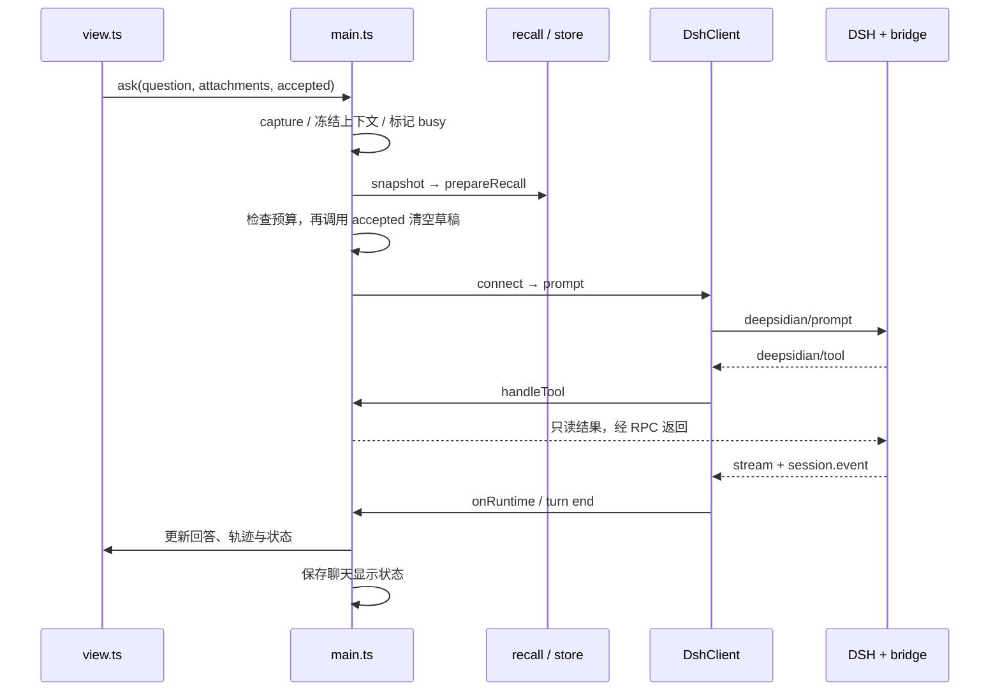

# 项目地图

面向首次接手的开发者与 AI 编码助手。先读本页定位入口，再按需求阅读源码；功能验收与未完成事项以 [Roadmap](RESEARCH-ROADMAP.md)、记忆约束以 [记忆设计](MEMORY-DESIGN.md) 为准。目录描述不是独立于代码的接口承诺。

## 工作区与修改边界

**以当前 Git 仓库作为源码真源**：在含 `package.json`、`manifest.json`、`src/` 的仓库根目录运行命令。外层工作区可能存在历史开发副本、开发知识库和学习笔记，不要反向覆盖本仓库，也不要把这些个人资料加入发布包。本地开发笔记与公共 `docs/` 分开维护；公共文档说明架构、使用和验证，本地笔记记录个人学习过程。

`dist/` 是构建输出；安装后的 `.obsidian/plugins/deepsidian/` 是部署目标，两者都不是源码。`node_modules/`、`.runs/`、`.preview/` 是依赖或验证产物，不要据此判断功能已发布，也不要上传运行时会话与凭据。

## 三个执行边界

| 所在位置 | 职责 | 关键限制 |
| --- | --- | --- |
| Obsidian 插件进程 | UI、笔记上下文、只读笔记工具、聊天显示状态、记忆存储与审批 | 不自行实现模型 agent loop；文件访问受当前知识库约束 |
| 独立 Node 子进程中的 DSH | 模型请求、工具循环、原生网络工具、会话持久化、取消 | 使用 `sdk-minimal` 加 patch；不能假设与完整 DSH Web 的插件清单相同 |
| DSH 内的 `bridge.mjs` | 自定义 JSON-RPC 通道、工具注册、事件转发、会话创建/恢复 | 不导入 Obsidian；将宿主工具交给父进程执行 |

长期记忆是 **Obsidian 宿主提供的存储、检索和提案工作流**，不是复用 DSH 原生长期记忆插件，也不是一个自动拥有文件写入权的 skill。整理器复用 DSH，但使用独立进程/会话，关闭宿主工具和网络工具，只返回待验证的 JSON 提案。

## 目录与阅读入口

```text
manifest.json                  Obsidian 插件入口元信息
styles.css                     侧栏、历史弹窗、记忆窗口样式
src/plugin/
  main.ts                      插件生命周期与协调器，优先阅读
  view.ts                      侧栏 DOM、输入、附件与流式显示
  history.ts                   会话历史弹窗、搜索、键盘交互
  commands.ts                  / 指令目录与解析
  settings.ts / setup.ts       设置页与首次连接引导
  types.ts                     Settings / Saved / Chat / Message
  context.ts / attachments.ts  当前笔记快照、路径与附件约束
  dsh.ts                       发现、进程启动、RPC、超时、取消
  bridge.mjs                   运行在 DSH 内的扩展
  discovery.ts                 跨平台 Node / DSH 路径候选
  versions.ts / updates.ts     已验证版本与官方更新查询
  trace.ts / trace-view.ts     事件投影、推理/用量、轨迹视图
  memory/
    store.ts                   本库文件存储、版本校验、写事务
    recall.ts                  每轮记忆快照、索引与只读检索
    proposals.ts               来源标识、整理提示词、提案验证
    organizer.ts               隔离整理器进程与取消
    scheduler.ts               闲时判定、预算、游标、待审批次
    modal.ts                   记忆管理、规则与会话开关
    organizer-modal.ts         来源/提案审核与应用入口
scripts/                       构建、安装、诊断、预览、真实模型验证
tests/                         纯逻辑、宿主模拟、运行时和 UI 回归
fixtures/                      合成测试知识库
docs/                          公共设计、协作、路线和截图
```

## 主调用链



- `/` 先进入 `runCommand()`；管理命令不作为普通文本发送模型。`/plan` 是单轮规划提示，`/goal` 是会话目标字段，不等于 DSH 原生持续 goal driver。
- `onLayoutReady()`、侧栏聚焦进入自动连接逻辑；`connecting/disconnecting` 合并并发任务。模型目录读取失败不应关闭已握手的连接。空闲连接回收与闲时记忆整理是两套不同逻辑。
- `bridge` 使用持久化 `stat` 判断创建或恢复 DSH 会话；前端消息数组不替代 DSH 的模型历史。修改显示记录不会自动修改运行时历史。
- 取消包含准备期取消与运行中取消。只改变 UI 的 `busy` 不等于已经停止子进程。

## 记忆调用链与状态归属

**读取**：`ask` → `MemoryStore.snapshot` → `prepareRecall` → 本轮提示词索引 → 模型按需调用 `memory_search/memory_read` → `readRecall`。快照在本轮固定，生成期间的编辑从下一轮生效；总开关与会话读取开关共同控制。检索输出有累计预算，不允许工具读取任意磁盘路径。

**手动整理**：`extractMemory` → 来源筛选与 `extractionPrompt` → `runOrganizer` → `parseProposals` → 审核窗口 → `applyMemoryProposals` → 重新检查来源、贡献开关和记忆版本 → `MemoryStore.update`。

**闲时整理**：`MemoryScheduler.tick` → 检查用户活动/开关/前台工作/额度/待审批次 → 保存预算预留 → 独立整理请求 → 保存待审提案与来源游标。前台活动取消后台整理；返回的提案不会自动成为正式记忆。调度状态和正式记忆属于不同存储，不能把“有 pending 提案”当作“已应用”。

| 状态 | 所有者与位置 | 修改注意 |
| --- | --- | --- |
| 设置、会话显示记录、activeId、闲时预算/游标/待审批次 | `main.ts` 的 `Saved`，通过 Obsidian `saveData` 写插件 `data.json` | `saveChange` 排队；暂存变更在写成功后提交，避免失败状态被后台保存复活 |
| DSH 完整会话与附件 | DSH，聊天 `.runtime/`；整理任务使用独立目录 | 不把它们当成前端 `Chat[]`；跨版本恢复要做集成测试 |
| 正式记忆正文与规则 | `MemoryStore`，插件目录下 `memory/` | 入口是 `snapshot/update`，不要从 UI 绕开版本校验直接写文件 |
| 当前轮上下文、记忆快照、生成中的文本 | `main.ts` 内存状态 | 同一轮保持一致；结束/失败/取消需要清理 |
| 输入与记忆编辑草稿 | 视图状态及 `memoryDrafts` | 只在请求被接受/保存成功后清理，不能因预检失败丢失 |

存储底层的 `writer.lock`、恢复 guard、写前事务与内容 revision 用于并发和恢复。`history()` 返回变更摘要和可撤销状态；`undo(revision, {restoreDeleted})` 撤销最近一次操作，删除恢复需明确确认。`journal.json` 与正文同事务保存，最多10条/512KiB，含旧正文。来源范围保存在 `Chat.memoryStart`（完整前缀hash）和 `memoryPolicyVersion`；`contributionSources()` 共用于手动与闲时提炼，历史前缀变化时拒绝而非回退。来源权限改变使旧待审提案失效。

## 按修改目标导航

| 要改什么 | 先读 | 验证重点 |
| --- | --- | --- |
| 侧栏/历史/快捷键 | `view.ts`, `history.ts`, `styles.css` | DOM 回归、焦点、异步保存、窄侧栏；原生 Obsidian 再验 |
| 新命令 | `commands.ts`, `main.runCommand` | 参数/附件拒绝、busy、管理命令不触发模型 |
| 新笔记工具 | `bridge.mjs` 注册 + `main.handleTool` | 路径范围、返回预算、取消、真实 DSH 工具循环 |
| DSH 升级 | `versions.ts`, `dsh.ts`, `bridge.mjs` | Messages 与 Chat Completions、事件、取消、旧会话恢复、无凭据日志 |
| 记忆检索 | `recall.ts`, `main.ask/handleTool` | 本轮冻结、关闭/删除、预算、跨库隔离 |
| 整理来源/规则 | `proposals.ts`, `scheduler.ts`, `organizer-modal.ts` | 原文证据、排除来源、范围变化、过期提案不能应用 |
| 存储/撤销 | `store.ts`, `main.applyMemoryProposals` | 中断恢复、revision 冲突、重复应用、撤销不能覆盖新修改 |
| 自动整理 | `scheduler.ts` 与 `main` 的 Host 适配 | 取消传播、预算先预留、游标、待审批次重载 |

## 验证命令

在仓库根目录执行；需要 Node.js 24+。

```sh
npm ci
npm run check
npm run doctor
npm run test:integration
npm run preview
```

- `check` = 类型检查、离线逻辑/宿主测试、构建；不等于已经运行真实 DSH。
- `test:integration` 启动本机 DSH 和 localhost 合成模型，覆盖工具、取消、联网工具边界和协议恢复。通过 `DSH_PACKAGE_ROOT` 指定待测安装；Messages 测试按运行时版本决定是否执行，旧会话迁移还需要 `DSH_LEGACY_PACKAGE_ROOT`。查看跳过数量，不能只看退出码。
- 预览中的 `?screen=history-tests`、`?screen=attachment-tests`、`?screen=memory-tests` 提供 DOM 检查；这是模拟 Obsidian 宿主，不覆盖原生窗口、主题和系统剪贴板。
- `npm run build` 后用 `npm run install:dev -- "<已有开发知识库>"` 安装构建产物，再由 Obsidian 重载插件。不要安装到未授权的个人知识库。
- `npm run live` 验证真实笔记工具与提炼正/负例，`npm run live:memory` 验证保存→跨会话读取→更正→重启→删除。均会产生费用，只在用户授权后运行。其合成测试报告位于 `.runs/`，保留失败输出，不自动重试；不要提交凭据或运行时原始会话。通过表示该次样例达标，不是概率性模型永不出错的保证。
- `npm run package:source -- "<不存在的导出目录>"` 按白名单导出，不会覆盖已有仓库；它不是日常同步命令。

继续深入：[架构与协作](ARCHITECTURE.md) · [记忆设计](MEMORY-DESIGN.md) · [路线与验收](RESEARCH-ROADMAP.md)。
`npm run eval:memory` 提供12类付费合成提炼样例与逐例证据；读 [记忆评测与发布门槛](MEMORY-EVALUATION.md) 了解自动断言和语义复核的区别。
