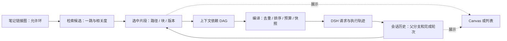

# 产品调研与实施路线

调研日期：2026-09-13。基线：Deepsidian 0.3.1、已安装 DSH 0.1.5-rc.2、Obsidian API 类型包 1.13.1。

本报告依据上游 README、官方规范与本机已安装包的接口；没有逐一安装竞品，也不是性能排名。下文“上游已有”不代表 Deepsidian 已接入，“建议”均为待实现设计。具体实现前应锁定上游 commit / 版本重新核对。当前能力以 [README](../README.md) 为准。

## 1. 推荐方向

优先做好“当前笔记 → 找到少量相关证据 → 开支线解释 → 带着来源回到原文”。最值得投入的是可定位的检索结果、可靠会话分叉和可检查的上下文组装。画布是这些能力的一种视图；Tab 补全是独立的低延迟请求路径，不应被无限画布或多 agent 阻塞。

0.3.1 已把原生 `web_search`、`web_fetch` 设为新安装默认开启；已有保存的 false 保留。仍按需启动 DSH，不在加载插件时搜索。默认可用不等于每问必联网：针对笔记语境优先查本库，涉及时效或用户要求验证时查网络。真实搜索服务权限还需账号实测，失败应显示原因，不能伪装成“没有结果”。

## 2. 同类项目：借鉴什么

| 项目及一手依据 | 上游目前公开的能力 | 对 Deepsidian 的建议 | 接入判断 |
| --- | --- | --- | --- |
| [Claudian](https://github.com/YishenTu/claudian) | 多种 coding agent、选区内编辑及词级 diff、文件 mention、命令/skills、MCP、多会话标签页 | 借鉴紧凑输入、局部编辑预览、持久会话导航；不恢复整篇回答插入按钮或常驻提示词按钮 | 交互可独立实现；CLI 适配层不直接等于 DSH 适配层 |
| [Copilot V4](https://github.com/logancyang/obsidian-copilot) | 已是 agent 产品；项目上下文、Skills/Commands、选区 Quick Ask，另有轻量 Quick Chat | 借鉴主题级上下文集合，以及“轻量问答 / 多步 agent”两条请求路径 | 不再把它归类成只有 RAG 的聊天框；项目能力不必附带第二套账号系统 |
| [Smart Connections](https://github.com/brianpetro/obsidian-smart-connections) | 本地 embedding、相关笔记/片段、语义查找、图与列表 | 先展示可预览的候选来源；搜索索引与对话模型解耦 | 先独立做关键词+元数据，embedding 后置；跨插件共享索引需要版本化接口，不能读私有缓存当长期协议 |
| [ThoughtDAG 的 DSH 插件](https://github.com/chenxiachan/thoughtdag/tree/main/dsh) | 在 DSH Web 宿主挂载画布；读取会话、fork、inject、followup 桥接；另有历史原因检索工具 | 优先研究轮次映射、来源引用和上下文编译，避免再造第二套会话引擎 | 已有 Web 桥不等于完整 Obsidian 集成；README 仍列出部分画布操作 UI 待办，不能把所有接口视为已完成功能 |
| [Various Complements](https://github.com/tadashi-aikawa/obsidian-various-complements-plugin) | IDE 风格的词语补全 | 借鉴键盘操作与冲突处理，作为补全共存测试对象 | 词语补全与生成式续写是不同需求，不必用 LLM 取代所有确定性补全 |

Claudian README 提到的 **Tabs 是会话标签页**，不是证明已有“Tab 接受 AI 灰字续写”。两者在本项目分别立项。

代码复用策略：先借鉴行为并独立实现。Claudian / ThoughtDAG 仓库展示 MIT，Copilot 展示 AGPL-3.0；Smart Connections 自述 source available，若实际复用须核对具体文件和版本许可。不要仅凭“公开仓库”就复制代码并只写致谢。本轮未引入竞品代码。

### ThoughtDAG 的三个合作层次

1. **近期：协议参考。** 将一次回答与 `sessionId + 完成轮次/事件边界` 对应，保留笔记片段来源；Deepsidian 用自己的 ItemView 和 Obsidian 文件交互。
2. **中期：数据互通实验。** 使用合成会话验证导入/导出，区分只读镜像与可执行节点；双方使用各自可验证的接口，避免同时写同一份运行日志。
3. **远期：可选画布适配器。** 评估抽离上下文编译器或承载完整 Web 视图的成本。其现有实现依赖 Web 服务器、前端注入和同源 iframe；本项目独立 SDK 进程没有这套宿主。直接嵌入会额外承担主题、焦点、附件、授权和进程管理成本。

上述是架构判断，尚未进行适配验证。不建议为了获得画布而默认启动完整 DSH Web 服务。上游快速迭代时，先锁定能通过合成会话测试的版本再谈复用。

## 3. 可以开放的工具与运行时能力

### Obsidian 侧：先补“理解笔记结构”的只读能力

现有四项是 `obsidian_context`、`obsidian_search`、`obsidian_read`、`obsidian_metadata`。新增工具名以下仅为设计提案。

| 候选能力 | 用途 / 输入输出 | 可行性与边界 | 优先级 |
| --- | --- | --- | --- |
| `resolve_reference` | 将 `[[别名]]`、相对链接、标题/块引用解析到真实文件与位置 | 用 metadataCache、getFirstLinkpathDest、resolveSubpath；保留解析起点，处理重名与失效引用 | P1，高 |
| `search_notes` 增强 | 多词匹配、标题/别名加权、路径/标签/frontmatter 过滤，返回得分与命中片段 | 先增量词法索引；现有最多扫描 300 文件的实现会漏掉大库内容 | P1，高 |
| `read_section` | 仅读指定标题或 block id，对结果提供稳定引用 | 编辑缓存与磁盘可能不同，读取须带来源版本；避免每次读整篇 | P1，高 |
| `neighbors` | 指定笔记的一跳出链、反链、未解析链接；按需二跳 | 限节点数、深度、去环；返回候选，不能自动把整个邻域注入模型 | P1，高 |
| 属性、目录与任务查询 | 比如“本专题有哪些未完成的问题”；返回路径、行号、属性 | 扩展现有 metadata；支持 YAML tags/aliases，而非仅内联标签。Dataview/Bases 独立适配，不能假设用户安装了它们 | P1–P2，中 |
| 附件读取 / 文档解析 | 截图、PDF 页码、文章摘录与原文件定位 | 图片已支持；PDF/OCR/音频需可选解析器和能力检测。不能只凭文件路径就声称模型看过图片 | P3，中 |
| `propose_edit` | 生成对某个区块的修改建议与 diff，用户选择应用 | 前置内容 hash、冲突重算、单次 undo；保留 frontmatter、链接和用户同期编辑 | P3，中 |
| 创建/重命名笔记 | 新建提纲；整理路径并维护链接 | 用 Obsidian Vault/FileManager 接口，先处理排除目录、附件和冲突；删除与批量修改后置 | P3，中 |
| Canvas 文件读写 | 导出分支探索图、加入证据卡片 | 标准 JSON 文件可行；直接操纵内置 Canvas 活视图属于待验证适配 | P2–P3，见下节 |

接口依据：[Obsidian 官方 API 仓库](https://github.com/obsidianmd/obsidian-api)，并核对本仓库 `node_modules/obsidian/obsidian.d.ts` 的上述接口。本机声明含 metadataCache 的 resolvedLinks / unresolvedLinks、processFrontMatter 和 registerEditorExtension；未找到可供本计划直接依赖的 GraphView / Canvas 活视图公开声明。

“打开笔记/定位引用”通常由用户点击就够了，不必变成模型每次都调用的工具。也不建议默认提供“执行任意 Obsidian 命令”：其他插件注册的命令可能修改大量文件，无法从命令名推断作用。

### DSH 侧：工具、服务和 UI 功能要分清

以下依据**本机 0.1.5-rc.2 包内 README 与类型**，对应源码集中在 [DSH 官方仓库](https://github.com/deepseek-ai/deepseek-harness)。这些包存在不代表已加载进 Deepsidian 的精简 composition。

| 能力 / 包 | 当前证据与拟用方式 | 需要补齐 |
| --- | --- | --- |
| 原生 web 工具 | 已集成；限制查询数、结果数与抓取长度，分别可关闭 | 真实账号验收、引用定位、失败诊断；匿名 fetch 不执行页面 JS |
| Skills：`dsh-skill`、`dsh-skill-filesystem`、`dsh-tool-skill` | 可公布简短目录，按需用 `skill` 加载完整指令；用户也可显式调用 | 仅加载用户选择的目录；显示实际加载来源与版本。Skill 是任务说明，不会凭空增加工具权限 |
| MCP：`dsh-mcp-client` | 可以把服务器工具注册到 DSH；适合可选学术检索、文档解析、浏览器后端 | 连接生命周期、工具选择、失败隔离、超时与来源提示。当前包只桥接 Tools，不能承诺 MCP Resources/Prompts 同样可用 |
| 会话 fork：`dsh-session` | `ctx.sessions.fork` 支持稳定前缀，边界须位于已完成轮次外 | 在本项目桥接协议新增命令、事件边界映射、持久化 lineage、图片继承和重启测试。不能复制 UI messages 数组冒充真正 fork |
| 上下文注入：`dsh-agent` | `inject` 加入后续模型输入且不唤醒；`followup` 排队并唤醒 | 定义何时提交、如何记录版本和取消。画布移动不能触发模型请求 |
| 压缩：`dsh-compaction` 等 | 可缩减活跃上下文，同时保留历史记录 | 先解决历史存储与来源，再验证摘要质量；暴露“压缩前后差异/仍保留的来源”，不靠偷偷删历史省 token |
| 子 agent：`dsh-subagent`、spawn/fork providers、`dsh-tool-subagent`、control | 有委派、延续与控制机制 | 本项目需另加组合、独立工具范围、并发/费用预算、取消传播、轨迹归属；先做单 agent 稳定检索 |

DSH 的 fork、日志、压缩是运行时服务，未必需要作为模型可随意调用的工具。用户点击“从此分叉”由宿主执行通常更明确。MCP 启用后的工具 schema 也占输入 token，故默认只暴露必要集合，不为每个请求加载所有集成。

[Scrapling](https://github.com/D4Vinci/Scrapling) 适合作为可选复杂网页抓取后端；它是抓取框架，不是通用搜索引擎。先让 DSH 搜索找到 URL，再用普通 fetch；确需动态页面时才考虑额外 Python/浏览器或 MCP 服务。不计划默认安装它，也不将抓取失败自动升级为有登录态的浏览器访问。

## 4. DAG 与链接、关系图谱、Canvas 如何结合

**Vault 是 Obsidian 打开的整个文件夹；note graph 是其中笔记链接构成的图；DAG 是有方向且不允许环的依赖图。** `A → B → A` 在知识链接中合理，但不能直接作为上下文递归展开规则。

建议三层数据各司其职：

图中反馈箭头表示下一次操作产生新记录；单次上下文依赖 DAG 内仍不允许环。知识关联边只表示“相关”，上下文边才表示“这次实际包含”。画布布局、折叠与缩放不改变输入。

### 最小数据契约（建议，尚未实现）

| 记录 | 最小字段与意义 |
| --- | --- |
| `NoteRef` | vault 内相对路径、heading/block 或行范围、内容 hash、可重放文本快照；重命名可更新位置而不篡改旧证据 |
| `TurnRef` | sessionId、已完成轮次对应 seq 边界、模型/参数、父分支引用 |
| `ContextManifest` | 本次选中引用的稳定 ID、确定顺序、删减理由、预算、编译版本 |
| `GraphEdge` | `related` / `context` / `derived-from` 类型；仅 context 边参与本次编译 |
| `CanvasBinding` | Canvas node id 与 NoteRef/TurnRef 的映射；运行状态不塞进 Markdown 正文 |

上下文编译器可先是纯 TypeScript 函数，不依赖画布组件。测试共享祖先去重、循环拒绝、顺序稳定和预算裁剪，再加交互。笔记修改后旧回答仍保留原始证据，并提示其引用已经变化；不能悄悄用新正文解释旧答案。

### 为什么先对接原生 Canvas 文件

[JSON Canvas 1.0](https://jsoncanvas.org/spec/1.0/) 定义 text/file/link/group 节点及边，文件节点可含 subpath。因此可以先导出“原笔记文件卡 + 支线摘要文本卡 + 来源边”，继续在 Obsidian 手动编辑。

第一阶段仅导出到用户指定的新 `.canvas`；第二阶段才增量同步，并通过 sidecar 保存 Deepsidian 绑定数据，保留用户节点、连线和布局。格式兼容不意味着内置视图会运行 agent，也不意味着原生关系图谱自动显示聊天节点。不要为此给每轮对话生成一篇 Markdown，污染真实知识图。

原生关系图谱继续负责发现笔记关联；Deepsidian 通过 metadataCache 使用相同的链接数据。实时高亮内置图谱、Canvas 节点上的运行按钮、拖线立即执行，均放入独立可关闭的后期实验，不把内部 API 作为基础依赖。

### 缓存策略

DeepSeek 文档说明缓存依赖请求前缀重复，提供 hit/miss token 用量；这不能推出“改一点上下文就全部失效”，也不能保证任意 DAG 重排免费。[官方上下文缓存说明](https://api-docs.deepseek.com/guides/kv_cache/)

建议保持角色、工具定义和既有历史稳定；新资料以追加事件提交。需要更换早期来源或重排依赖时创建新分支，显示新的 ContextManifest。把缓存命中、输入 token、首字延迟、答案质量一起比较；没有实际 usage 字段就标为不可用。不要为了缓存保留误导当前问题的旧资料。

## 5. Tab、选区编辑及其他交互

会话标签页可先做轻量导航：切换聊天无需启动额外进程，初期同时只运行一个请求，避免从“多标签”无意变成“多 agent 并发”。

**生成式补全分两步：**先用命令手动请求一句续写，之后才试自动灰字。编辑器侧用 `registerEditorExtension` 接 CodeMirror；请求侧评估 DSH 的轻量 LLM 流接口，复用模型配置，单独取消与限额，不进入有工具的长循环。已有调用途径不等于低延迟体验已验证。

候选仅带光标前后少量正文；不每个键盘事件检索全库或联网。结果绑定文件、选区、文档版本；输入变化/切换文件立即作废。中文输入法 composition 期间不触发；可见且有效时 Tab 接受，否则保留缩进/其他插件行为，Esc 拒绝，支持单次撤销。自动触发阈值应通过延迟和接受率实验确定；先用 chat 模型短请求验证，不假定当前模型提供 FIM（中间填空）接口。

局部改写放进选区命令或右键入口，按片段预览 diff。普通聊天继续保持简洁，不加“再基础一点”之类常驻按钮。可复用任务放到用户定义的 `/` 命令与按需 skills 中。

## 6. Roadmap 与可验收的切片

S/M/L 表示相对复杂度，不是日历承诺。P0/P1 是下一轮主线；P2 数据基础完成后，画布和补全可按实际需求选择先后。

| 阶段 | 交付与依赖 | 可行性 / 工作量 | 验收与止损条件 |
| --- | --- | --- | --- |
| P0 可靠性 | 按会话存储/分页，轨迹可由日志重建；新机引导、脱敏诊断、DSH 兼容矩阵 | 高 / M；已有日志需迁移 | 迁移保留聊天和图片，坏记录可隔离；测 100/1000 轮加载与启动基线；新机未安装 DSH 时仍可开 Obsidian。发布前锁版本运行兼容测试 |
| P1 证据检索 | 引用解析、标题/块读取、属性/别名、链接邻居、词法排序与按需索引；依赖来源 ID | 高 / M | 20 个固定查询覆盖中文、别名、重名、块、删除/重命名；统计 Recall@5、错误引用和延迟；显示扫描/索引范围，不把未覆盖称为不存在 |
| P1b 上下文清单 | 当前问题带了什么、为何选中、内容版本/预算；先列表后画布 | 高 / M；依赖 P1 引用 | 从清单重放得到一致输入；用户排除资料后下一轮不读取它；引用跳转到具体段落 |
| P2 会话分叉 | 从完成轮次 fork，父支线导航，手动将带来源的摘要送回主线 | 中高 / M；依赖 P0 和 DSH 桥 | 父历史不变；工具中间轮次禁止分叉；图片、取消、重启后 lineage 保留；不自动拼接两条历史 |
| P2b Canvas MVP | ContextManifest 导出新 Canvas；导入选中卡片作为候选；ThoughtDAG 合成会话互通实验 | 文件级高、实时适配中低 / M–L | 无运行时也能打开；布局不触发请求；去重/去环可测；互通无法保留来源时只提供只读导出 |
| P3 编辑辅助 | 手动短续写、选区局部修改，再试 Tab 灰字 | 中 / M；与 Canvas 无硬依赖 | 中文 IME、缩进、其他补全插件共存；零过期插入；记录 p50/p95 延迟、接受率和 token 成本，过慢则保留手动模式 |
| P3b 可选语义检索 | 词法+embedding 混合排序、后台增量构建/暂停 | 中 / M–L；先有 P1 样例 | 同一评测集确实改善检索才保留；测索引体积/冷启动/重命名；不在启动时默认整库向量化 |
| P4 扩展集成 | 用户选择的 Skills/MCP、PDF/动态网页、受控写入 | 中 / L；依赖能力与权限配置 | 某个后端不可用不阻断聊天；有来源和调用范围；所有写入处理冲突与撤销 |
| P5 并行 agent / 活画布 | 比较多个来源、独立研究分支、可执行 Canvas UI | 中低 / L；依赖 P2/P4 | 明确子任务归属、费用上限、父子取消；比较单 agent 基线确有收益再默认展示；不默认后台常驻 |

协作切分建议：一位维护 DSH adapter / session 协议与合成集成测试；另一位维护检索、引用契约及 UI。先约定 NoteRef / TurnRef / ContextManifest 和协议版本再同时改前后端，不让组件自行读取运行时磁盘格式。

更新检测继续按连接后 24 小时限频，不要求每次打开仓库都访问上游。开发时先记录本机版本；升级、修改桥接接口和发布前重新核对上游并运行合成集成测试。检测到新版本只提示，不能自动把最新预览版当兼容版。

## 7. 应用场景与需要质疑的假设

- **概念岔路：**写缓存笔记时不懂 KV，从该轮开支线，引用当前段落和一篇基础笔记。弄懂后手动把两句摘要带回，主线保留干净的问题历史。这是 fork + 来源清单最直接的验收场景。
- **矛盾定位：**两篇笔记对同一术语解释冲突，分别定位来源、日期和适用条件。联网用于验证变化，不让较新网页无条件覆盖用户自己的实验记录。
- **补齐链接：**发现已有解释但当前笔记未链接，展示具体段落，用户拖入引用即可；不因为主题相近自动创建一堆双链。
- **解释代码与截图：**用户主动附截图，再查相关笔记；输出引用能区分图像观察、笔记内容和模型推断。OCR 文字不能冒充原图含义。
- **比较阅读：**图上摆两段原文和一个问题节点，明确只带这两段，得到带来源的异同比较；旧答案在来源变化后标记待复核。
- **知识状态：**有一篇笔记不等于已经掌握。用户明确的背景优先，模型推测应可纠正/删除。早期不自动构建“掌握度分数”；先记录用户认可的前提和解释偏好。

需要持续追问的产品假设：无限画布是否真的减少找回主线的成本，还是增加整理负担？先用会话树+来源列表验证。Tab 是否帮助表达，还是提前替用户完成思考？应可按文件/目录关闭。更多工具是否增加有效证据，还是造成更长的 schema 和更慢请求？按任务选择集合，而不是把宿主所有能力一股脑开放。

下一次实现建议聚焦 **P0 会话存储 + P1 可定位的证据检索**，然后用“概念岔路”验证 P2。研究中的高级能力暂不改变当前插件行为。
