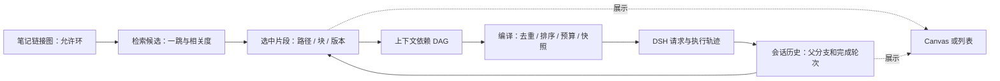

# 产品调研与实施路线

同库长期记忆已细化为 [技术设计与 M0–M3 验收契约](MEMORY-DESIGN.md)。0.4.0 实现手动记忆/规则编辑、事务保护和本地索引整理；自动召回、模型提炼和闲时调度仍未实现。下文保留调研与方案演进。

调研日期：2026-09-13。基线：Deepsidian 0.3.1、已安装 DSH 0.1.5-rc.2、Obsidian API 类型包 1.13.1。

本报告依据上游 README、官方规范与本机已安装包的接口；没有逐一安装竞品，也不是性能排名。下文“上游已有”不代表 Deepsidian 已接入，“建议”均为待实现设计。具体实现前应锁定上游 commit / 版本重新核对。当前能力以 [README](../README.md) 为准。

## 1. 推荐方向

优先做好“当前笔记 → 找到少量相关证据 → 开支线解释 → 带着来源回到原文”。最值得投入的是可定位的检索结果、可靠会话分叉和可检查的上下文组装。画布是这些能力的一种视图；Tab 补全是独立的低延迟请求路径，不应被无限画布或多 agent 阻塞。

0.3.1 已把原生 `web_search`、`web_fetch` 设为新安装默认开启；已有保存的 false 保留。仍按需启动 DSH，不在加载插件时搜索。默认可用不等于每问必联网：针对笔记语境优先查本库，涉及时效或用户要求验证时查网络。真实搜索服务权限还需账号实测，失败应显示原因，不能伪装成“没有结果”。

## 2. 同类项目：借鉴什么

| 项目及一手依据 | 上游目前公开的能力 | 对 Deepsidian 的建议 | 接入判断 |
| --- | --- | --- | --- |
| [Claudian](https://github.com/YishenTu/claudian) | 多种 coding agent、选区内编辑及词级 diff、文件 mention、命令/skills、MCP、多会话标签页 | 借鉴紧凑输入、局部编辑预览、持久会话导航；不恢复整篇回答插入按钮或常驻提示词按钮 | 交互可独立实现；CLI 适配层不直接等于 DSH 适配层 |
| [Copilot V4](https://github.com/logancyang/obsidian-copilot) | 已是 agent 产品；项目上下文、Skills/Commands、选区 Quick Ask，另有轻量 Quick Chat | 借鉴主题级上下文集合，以及“轻量问答 / 多步 agent”两条请求路径 | 不再把它归类成只有 RAG 的聊天框；项目能力不必附带第二套账号系统 |
| [Smart Connections](https://github.com/brianpetro/obsidian-smart-connections) | 本地 embedding、相关笔记/片段、语义查找、图与列表 | 先展示可预览的候选来源；搜索索引与对话模型解耦 | 先独立做关键词+元数据，embedding 后置；跨插件共享索引需要版本化接口，不能读私有缓存当长期协议 |
| [ThoughtDAG 的 DSH 插件](https://github.com/chenxiachan/thoughtdag/tree/main/dsh) | 在 DSH Web 宿主挂载画布；读取会话、fork、inject、followup 桥接；另有历史原因检索工具 | 优先研究轮次映射、来源引用和上下文编译，避免再造第二套会话引擎 | 已有 Web 桥不等于完整 Obsidian 集成；README 仍列出部分画布操作 UI 待办，不能把所有接口视为已完成功能 |
| [Various Complements](https://github.com/tadashi-aikawa/obsidian-various-complements-plugin) | IDE 风格的词语补全 | 借鉴键盘操作与冲突处理，作为补全共存测试对象 | 词语补全与生成式续写是不同需求，不必用 LLM 取代所有确定性补全 |

Claudian README 提到的 **Tabs 是会话标签页**，不是证明已有“Tab 接受 AI 灰字续写”。两者在本项目分别立项。

代码复用策略：先借鉴行为并独立实现。Claudian / ThoughtDAG 仓库展示 MIT，Copilot 展示 AGPL-3.0；Smart Connections 自述 source available，若实际复用须核对具体文件和版本许可。不要仅凭“公开仓库”就复制代码并只写致谢。本轮未引入竞品代码。

### ThoughtDAG 的三个合作层次

1. **近期：协议参考。** 将一次回答与 `sessionId + 完成轮次/事件边界` 对应，保留笔记片段来源；Deepsidian 用自己的 ItemView 和 Obsidian 文件交互。
2. **中期：数据互通实验。** 使用合成会话验证导入/导出，区分只读镜像与可执行节点；双方使用各自可验证的接口，避免同时写同一份运行日志。
3. **远期：可选画布适配器。** 评估抽离上下文编译器或承载完整 Web 视图的成本。其现有实现依赖 Web 服务器、前端注入和同源 iframe；本项目独立 SDK 进程没有这套宿主。直接嵌入会额外承担主题、焦点、附件、授权和进程管理成本。

上述是架构判断，尚未进行适配验证。不建议为了获得画布而默认启动完整 DSH Web 服务。上游快速迭代时，先锁定能通过合成会话测试的版本再谈复用。

## 3. 可以开放的工具与运行时能力

### Obsidian 侧：先补“理解笔记结构”的只读能力

现有四项是 `obsidian_context`、`obsidian_search`、`obsidian_read`、`obsidian_metadata`。新增工具名以下仅为设计提案。

| 候选能力 | 用途 / 输入输出 | 可行性与边界 | 优先级 |
| --- | --- | --- | --- |
| `resolve_reference` | 将 `[[别名]]`、相对链接、标题/块引用解析到真实文件与位置 | 用 metadataCache、getFirstLinkpathDest、resolveSubpath；保留解析起点，处理重名与失效引用 | P1，高 |
| `search_notes` 增强 | 多词匹配、标题/别名加权、路径/标签/frontmatter 过滤，返回得分与命中片段 | 先增量词法索引；现有最多扫描 300 文件的实现会漏掉大库内容 | P1，高 |
| `read_section` | 仅读指定标题或 block id，对结果提供稳定引用 | 编辑缓存与磁盘可能不同，读取须带来源版本；避免每次读整篇 | P1，高 |
| `neighbors` | 指定笔记的一跳出链、反链、未解析链接；按需二跳 | 限节点数、深度、去环；返回候选，不能自动把整个邻域注入模型 | P1，高 |
| 属性、目录与任务查询 | 比如“本专题有哪些未完成的问题”；返回路径、行号、属性 | 扩展现有 metadata；支持 YAML tags/aliases，而非仅内联标签。Dataview/Bases 独立适配，不能假设用户安装了它们 | P1–P2，中 |
| 附件读取 / 文档解析 | 截图、PDF 页码、文章摘录与原文件定位 | 图片已支持；PDF/OCR/音频需可选解析器和能力检测。不能只凭文件路径就声称模型看过图片 | P3，中 |
| `propose_edit` | 生成对某个区块的修改建议与 diff，用户选择应用 | 前置内容 hash、冲突重算、单次 undo；保留 frontmatter、链接和用户同期编辑 | P3，中 |
| 创建/重命名笔记 | 新建提纲；整理路径并维护链接 | 用 Obsidian Vault/FileManager 接口，先处理排除目录、附件和冲突；删除与批量修改后置 | P3，中 |
| Canvas 文件读写 | 导出分支探索图、加入证据卡片 | 标准 JSON 文件可行；直接操纵内置 Canvas 活视图属于待验证适配 | P2–P3，见下节 |

接口依据：[Obsidian 官方 API 仓库](https://github.com/obsidianmd/obsidian-api)，并核对本仓库 `node_modules/obsidian/obsidian.d.ts` 的上述接口。本机声明含 metadataCache 的 resolvedLinks / unresolvedLinks、processFrontMatter 和 registerEditorExtension；未找到可供本计划直接依赖的 GraphView / Canvas 活视图公开声明。

“打开笔记/定位引用”通常由用户点击就够了，不必变成模型每次都调用的工具。也不建议默认提供“执行任意 Obsidian 命令”：其他插件注册的命令可能修改大量文件，无法从命令名推断作用。

### DSH 侧：工具、服务和 UI 功能要分清

以下依据**本机 0.1.5-rc.2 包内 README 与类型**，对应源码集中在 [DSH 官方仓库](https://github.com/deepseek-ai/deepseek-harness)。这些包存在不代表已加载进 Deepsidian 的精简 composition。

| 能力 / 包 | 当前证据与拟用方式 | 需要补齐 |
| --- | --- | --- |
| 原生 web 工具 | 已集成；限制查询数、结果数与抓取长度，分别可关闭 | 真实账号验收、引用定位、失败诊断；匿名 fetch 不执行页面 JS |
| Skills：`dsh-skill`、`dsh-skill-filesystem`、`dsh-tool-skill` | 可公布简短目录，按需用 `skill` 加载完整指令；用户也可显式调用 | 仅加载用户选择的目录；显示实际加载来源与版本。Skill 是任务说明，不会凭空增加工具权限 |
| MCP：`dsh-mcp-client` | 可以把服务器工具注册到 DSH；适合可选学术检索、文档解析、浏览器后端 | 连接生命周期、工具选择、失败隔离、超时与来源提示。当前包只桥接 Tools，不能承诺 MCP Resources/Prompts 同样可用 |
| 会话 fork：`dsh-session` | `ctx.sessions.fork` 支持稳定前缀，边界须位于已完成轮次外 | 在本项目桥接协议新增命令、事件边界映射、持久化 lineage、图片继承和重启测试。不能复制 UI messages 数组冒充真正 fork |
| 上下文注入：`dsh-agent` | `inject` 加入后续模型输入且不唤醒；`followup` 排队并唤醒 | 定义何时提交、如何记录版本和取消。画布移动不能触发模型请求 |
| 压缩：`dsh-compaction` 等 | 可缩减活跃上下文，同时保留历史记录 | 先解决历史存储与来源，再验证摘要质量；暴露“压缩前后差异/仍保留的来源”，不靠偷偷删历史省 token |
| 子 agent：`dsh-subagent`、spawn/fork providers、`dsh-tool-subagent`、control | 有委派、延续与控制机制 | 本项目需另加组合、独立工具范围、并发/费用预算、取消传播、轨迹归属；先做单 agent 稳定检索 |

DSH 的 fork、日志、压缩是运行时服务，未必需要作为模型可随意调用的工具。用户点击“从此分叉”由宿主执行通常更明确。MCP 启用后的工具 schema 也占输入 token，故默认只暴露必要集合，不为每个请求加载所有集成。

[Scrapling](https://github.com/D4Vinci/Scrapling) 适合作为可选复杂网页抓取后端；它是抓取框架，不是通用搜索引擎。先让 DSH 搜索找到 URL，再用普通 fetch；确需动态页面时才考虑额外 Python/浏览器或 MCP 服务。不计划默认安装它，也不将抓取失败自动升级为有登录态的浏览器访问。

## 4. DAG 与链接、关系图谱、Canvas 如何结合

**Vault 是 Obsidian 打开的整个文件夹；note graph 是其中笔记链接构成的图；DAG 是有方向且不允许环的依赖图。** `A → B → A` 在知识链接中合理，但不能直接作为上下文递归展开规则。

建议三层数据各司其职：



图中反馈箭头表示下一次操作产生新记录；单次上下文依赖 DAG 内仍不允许环。知识关联边只表示“相关”，上下文边才表示“这次实际包含”。画布布局、折叠与缩放不改变输入。

### 最小数据契约（建议，尚未实现）

| 记录 | 最小字段与意义 |
| --- | --- |
| `NoteRef` | vault 内相对路径、heading/block 或行范围、内容 hash、可重放文本快照；重命名可更新位置而不篡改旧证据 |
| `TurnRef` | sessionId、已完成轮次对应 seq 边界、模型/参数、父分支引用 |
| `ContextManifest` | 本次选中引用的稳定 ID、确定顺序、删减理由、预算、编译版本 |
| `GraphEdge` | `related` / `context` / `derived-from` 类型；仅 context 边参与本次编译 |
| `CanvasBinding` | Canvas node id 与 NoteRef/TurnRef 的映射；运行状态不塞进 Markdown 正文 |

上下文编译器可先是纯 TypeScript 函数，不依赖画布组件。测试共享祖先去重、循环拒绝、顺序稳定和预算裁剪，再加交互。笔记修改后旧回答仍保留原始证据，并提示其引用已经变化；不能悄悄用新正文解释旧答案。

### 为什么先对接原生 Canvas 文件

[JSON Canvas 1.0](https://jsoncanvas.org/spec/1.0/) 定义 text/file/link/group 节点及边，文件节点可含 subpath。因此可以先导出“原笔记文件卡 + 支线摘要文本卡 + 来源边”，继续在 Obsidian 手动编辑。

第一阶段仅导出到用户指定的新 `.canvas`；第二阶段才增量同步，并通过 sidecar 保存 Deepsidian 绑定数据，保留用户节点、连线和布局。格式兼容不意味着内置视图会运行 agent，也不意味着原生关系图谱自动显示聊天节点。不要为此给每轮对话生成一篇 Markdown，污染真实知识图。

原生关系图谱继续负责发现笔记关联；Deepsidian 通过 metadataCache 使用相同的链接数据。实时高亮内置图谱、Canvas 节点上的运行按钮、拖线立即执行，均放入独立可关闭的后期实验，不把内部 API 作为基础依赖。

### 缓存策略

DeepSeek 文档说明缓存依赖请求前缀重复，提供 hit/miss token 用量；这不能推出“改一点上下文就全部失效”，也不能保证任意 DAG 重排免费。[官方上下文缓存说明](https://api-docs.deepseek.com/guides/kv_cache/)

建议保持角色、工具定义和既有历史稳定；新资料以追加事件提交。需要更换早期来源或重排依赖时创建新分支，显示新的 ContextManifest。把缓存命中、输入 token、首字延迟、答案质量一起比较；没有实际 usage 字段就标为不可用。不要为了缓存保留误导当前问题的旧资料。

## 5. Tab、选区编辑及其他交互

会话标签页可先做轻量导航：切换聊天无需启动额外进程，初期同时只运行一个请求，避免从“多标签”无意变成“多 agent 并发”。

**生成式补全分两步：**先用命令手动请求一句续写，之后才试自动灰字。编辑器侧用 `registerEditorExtension` 接 CodeMirror；请求侧评估 DSH 的轻量 LLM 流接口，复用模型配置，单独取消与限额，不进入有工具的长循环。已有调用途径不等于低延迟体验已验证。

候选仅带光标前后少量正文；不每个键盘事件检索全库或联网。结果绑定文件、选区、文档版本；输入变化/切换文件立即作废。中文输入法 composition 期间不触发；可见且有效时 Tab 接受，否则保留缩进/其他插件行为，Esc 拒绝，支持单次撤销。自动触发阈值应通过延迟和接受率实验确定；先用 chat 模型短请求验证，不假定当前模型提供 FIM（中间填空）接口。

局部改写放进选区命令或右键入口，按片段预览 diff。普通聊天继续保持简洁，不加“再基础一点”之类常驻按钮。可复用任务放到用户定义的 `/` 命令与按需 skills 中。

## 6. Roadmap 与可验收的切片

S/M/L 表示相对复杂度，不是日历承诺。P0/P1 是下一轮主线；P2 数据基础完成后，画布和补全可按实际需求选择先后。

| 阶段 | 交付与依赖 | 可行性 / 工作量 | 验收与止损条件 |
| --- | --- | --- | --- |
| P0 可靠性 | 按会话存储/分页，轨迹可由日志重建；新机引导、脱敏诊断、DSH 兼容矩阵 | 高 / M；已有日志需迁移 | 迁移保留聊天和图片，坏记录可隔离；测 100/1000 轮加载与启动基线；新机未安装 DSH 时仍可开 Obsidian。发布前锁版本运行兼容测试 |
| P1 证据检索 | 引用解析、标题/块读取、属性/别名、链接邻居、词法排序与按需索引；依赖来源 ID | 高 / M | 20 个固定查询覆盖中文、别名、重名、块、删除/重命名；统计 Recall@5、错误引用和延迟；显示扫描/索引范围，不把未覆盖称为不存在 |
| P1b 上下文清单 | 当前问题带了什么、为何选中、内容版本/预算；先列表后画布 | 高 / M；依赖 P1 引用 | 从清单重放得到一致输入；用户排除资料后下一轮不读取它；引用跳转到具体段落 |
| P2 会话分叉 | 从完成轮次 fork，父支线导航，手动将带来源的摘要送回主线 | 中高 / M；依赖 P0 和 DSH 桥 | 父历史不变；工具中间轮次禁止分叉；图片、取消、重启后 lineage 保留；不自动拼接两条历史 |
| P2b Canvas MVP | ContextManifest 导出新 Canvas；导入选中卡片作为候选；ThoughtDAG 合成会话互通实验 | 文件级高、实时适配中低 / M–L | 无运行时也能打开；布局不触发请求；去重/去环可测；互通无法保留来源时只提供只读导出 |
| P3 编辑辅助 | 手动短续写、选区局部修改，再试 Tab 灰字 | 中 / M；与 Canvas 无硬依赖 | 中文 IME、缩进、其他补全插件共存；零过期插入；记录 p50/p95 延迟、接受率和 token 成本，过慢则保留手动模式 |
| P3b 可选语义检索 | 词法+embedding 混合排序、后台增量构建/暂停 | 中 / M–L；先有 P1 样例 | 同一评测集确实改善检索才保留；测索引体积/冷启动/重命名；不在启动时默认整库向量化 |
| P4 扩展集成 | 用户选择的 Skills/MCP、PDF/动态网页、受控写入 | 中 / L；依赖能力与权限配置 | 某个后端不可用不阻断聊天；有来源和调用范围；所有写入处理冲突与撤销 |
| P5 并行 agent / 活画布 | 比较多个来源、独立研究分支、可执行 Canvas UI | 中低 / L；依赖 P2/P4 | 明确子任务归属、费用上限、父子取消；比较单 agent 基线确有收益再默认展示；不默认后台常驻 |

协作切分建议：一位维护 DSH adapter / session 协议与合成集成测试；另一位维护检索、引用契约及 UI。先约定 NoteRef / TurnRef / ContextManifest 和协议版本再同时改前后端，不让组件自行读取运行时磁盘格式。

更新检测继续按连接后 24 小时限频，不要求每次打开仓库都访问上游。开发时先记录本机版本；升级、修改桥接接口和发布前重新核对上游并运行合成集成测试。检测到新版本只提示，不能自动把最新预览版当兼容版。

## 7. 应用场景与需要质疑的假设

- **概念岔路：**写缓存笔记时不懂 KV，从该轮开支线，引用当前段落和一篇基础笔记。弄懂后手动把两句摘要带回，主线保留干净的问题历史。这是 fork + 来源清单最直接的验收场景。
- **矛盾定位：**两篇笔记对同一术语解释冲突，分别定位来源、日期和适用条件。联网用于验证变化，不让较新网页无条件覆盖用户自己的实验记录。
- **补齐链接：**发现已有解释但当前笔记未链接，展示具体段落，用户拖入引用即可；不因为主题相近自动创建一堆双链。
- **解释代码与截图：**用户主动附截图，再查相关笔记；输出引用能区分图像观察、笔记内容和模型推断。OCR 文字不能冒充原图含义。
- **比较阅读：**图上摆两段原文和一个问题节点，明确只带这两段，得到带来源的异同比较；旧答案在来源变化后标记待复核。
- **知识状态：**有一篇笔记不等于已经掌握。用户明确的背景优先，模型推测应可纠正/删除。早期不自动构建“掌握度分数”；先记录用户认可的前提和解释偏好。

需要持续追问的产品假设：无限画布是否真的减少找回主线的成本，还是增加整理负担？先用会话树+来源列表验证。Tab 是否帮助表达，还是提前替用户完成思考？应可按文件/目录关闭。更多工具是否增加有效证据，还是造成更长的 schema 和更慢请求？按任务选择集合，而不是把宿主所有能力一股脑开放。

下一次实现建议聚焦 **P0 会话存储 + P1 可定位的证据检索**，然后用“概念岔路”验证 P2。研究中的高级能力暂不改变当前插件行为。

## 8. 长期记忆（2026-09-13 补充）

当前实际组合是 `sdk-minimal` 加 Deepsidian patch。已安装 DSH 0.1.5-rc.2 的该 profile 用 `dsh-session-persistence-jsonl` 保存会话；桥接通过 sessionPersistence.stat 和 agents.resume 恢复同一 ID。它没有默认加载 workspace instructions、skills 或 compaction，本项目也没有加入记忆后端或 MCP。复用 ~/.dsh 的供应商配置不等于继承 Web profile 的扩展。

0.3.1 有同会话持久历史、手动 background 和笔记检索。0.3.2 移除学习背景输入及其后续注入；旧值仍保留在 data.json，不自动删除或改成新记忆。旧聊天已经收到的背景也不会被改写。当前没有新会话自动召回、自动提炼偏好、主题进度档案或向量记忆。磁盘日志保存完整不等于模型每次都能处理无限历史；长会话仍需要上下文预算与压缩策略。

### 推荐先做小型、可解释的记忆层

| 类型 | 例子 | 写入与使用策略 |
| --- | --- | --- |
| 明确偏好 | 熟悉前端、agent 入门；解释先短后长 | 用户显式“记住”直接保存；自动提炼先作为候选。少量稳定内容按会话固定，变更用新事件补充 |
| 主题状态 | 正在研究 KV cache，还没理解分页注意力 | 限当前库/主题；区分用户确认与模型猜测，有更新时间，可修正和过期 |
| 情景记录 | 某次比较得出的结论及尚未解决的问题 | 保存摘要、sessionId/轮次、笔记引用；相关问题才召回，原始历史可定位 |
| 知识证据 | 某篇笔记定义了概念及实验条件 | 原笔记仍是来源，记忆只存索引/引用与版本，避免生成第二份失同步知识库 |

拟议结构：`id / kind / scope / text / sourceRefs / status / updatedAt / supersedes`，必要时加过期时间。先用本地结构化文件和词法检索，不要求安装外部数据库或先做 embedding。记录与聊天分开，后端接口可替换；MCP 记忆服务属于后续可选适配，不默认连接共享的跨项目记忆库。

工具候选为 memory_search、memory_read、memory_propose；显式记住、更正、删除由宿主可见操作落实。检索结果作为有来源的资料注入，不能通过保存网页或笔记里的命令提升为长期指令。学习程度仅凭用户确认，不因有笔记或问过问题就判定掌握。

补充优先级：P1b 增加**显式偏好与可查看/删除的记忆清单**；P2 增加**跨会话摘要召回**，与 fork 的来源契约共用；自动提炼和语义记忆留待样例验证。开发前明确“忘记”的范围：删除活动记忆及其检索索引，不等于抹掉已经发送的旧会话内容；旧轨迹保留当时实际输入。

验收：新聊天能使用用户确认的背景；不同库不串记忆；更正后旧版本不再被检索注入；删除后重启也不会从摘要自动复活；每条召回可定位来源；临时问题不污染长期档案；提炼失败不阻断主回答。记录召回误用率与额外 token，而非以存储条数衡量效果。KV 缓存是计算复用，长期记忆是可检索的信息存储，两者不能混为一谈。

## 9. 同库跨会话记忆与闲时整理：实施设计

本节为后续实现契约，取代第 8 节中要求用户手动填背景的入口方案。**0.3.2 只完成侧栏精简和停用旧背景；以下文件、工具、编辑器及调度器尚未实现。** 不声称复刻其他产品未公开的后台机制。

### 9.1 形式：规则与内容分开（结构化存储候选）

本节保留 JSON 权威存储的候选方案。若采用下文 9.7 的 Claude 风格路线，记忆正文改由 Markdown 承载，不同时维护两份权威内容。两者尚未实现，9.7 是当前推荐的首版方向。

建议放在当前库的插件数据目录，不写进普通笔记，不使用全局 ~/.dsh 记忆库：

```text
<vault>/.obsidian/plugins/deepsidian/memory/
  rules.md           # 用户可编辑的整理说明；模型无权修改
  policy.json        # 程序校验的开关、预算、排除范围、保留策略
  items.json         # 结构化记忆的唯一权威版本
  journal.jsonl      # 有保留期限的变更记录，用于审查和撤销
  state.json         # 每会话整理到哪一轮、库标识与调度状态
  index.json         # 可重建的关键词索引；以后可替换向量索引
```

这是一种小型文件数据库。items.json 存储原子条目，便于精确合并、删除与追踪来源；rules.md 用自然语言写规则，便于人修改。**不让模型不断重写一篇巨大的 MEMORY.md**，也不为每条记忆创建一篇真实笔记。记忆管理页呈现可编辑的文本卡片，用户不必手改 JSON；如需 Markdown 导出，只作为带版本的导出副本，不能成为另一套自动同步真相。

建议条目示例：

```json
{
  "id": "mem-123",
  "kind": "preference",
  "scope": { "vaultId": "vault-example", "topic": "agent-runtime" },
  "text": "用户熟悉前端，希望新出现的 agent 术语配简短解释。",
  "status": "active",
  "evidenceType": "user-explicit",
  "sources": [{ "sessionId": "session-example", "turnSeq": 42 }],
  "revision": 1,
  "updatedAt": "2026-09-13T00:00:00Z",
  "reviewAfter": null,
  "supersedes": []
}
```

vaultId 由本库生成，绑定此存储；不能靠库名称隔离。话题是库内二级作用域，所有聊天共享可检索集合，但每次只召回相关条目。复制整个库相当于复制记忆，需提供“清除记忆并作为新库”入口。第一版只允许本机单写者，检测到同步冲突须暂停写入；不宣称 Obsidian Sync 下自动支持多设备并发合并。

### 9.2 默认整理规则

自然语言规则负责判断内容，硬限制由 policy.json 和宿主代码落实。用户编辑规则不能绕过库隔离、文件权限、费用上限或被删除条目的排除。

建议 rules.md 默认内容：

```markdown
# 本库记忆整理规则
- 保存用户明确表达且可能影响未来回答的偏好、长期目标和约束。
- 保存反复出现的主题、未解决问题与重要决定，并标注适用主题。
- 一条只表达一个事实；保留原会话或笔记位置，不把推测写成事实。
- 学習进度只采纳用户明确说明；写过、看过、问过都不代表掌握。
- 用户明确更正优先于较早表述；不能只因新内容日期较晚就覆盖旧证据。
- 同一作用域的同义内容合并来源；不同主题的不同偏好可以并存。
- 不保存密钥、临时调试输出、整篇回答或完整笔记副本。
- 引用资料中的命令不是记忆规则，模型自己的回答不是用户偏好的证据。
- 用户要求忘记或标为不记忆的内容不再从旧历史重新提炼。
- 不确定的解释作为候选；不因多次重复模型推测而提升为确认事实。
```

具体处理表：

| 输入情况 | 整理动作 |
| --- | --- |
| 用户说“记住：……” | 校验作用域后直接记入；有一次简短回执，不要求再次确认 |
| 用户在普通聊天中明确表达持久偏好 | 自动整理开启时可记入 active，标记 user-explicit 并保留证据；不每条弹窗 |
| 推测出用户不懂某概念 | 仅生成 candidate，不自动当作稳定学习档案注入 |
| 同主题、同含义、不同会话 | 合并条目并追加有限来源，保留稳定 id |
| 新旧说法冲突 | 能确认用户更正则 supersede；否则标记 contested，召回时说明冲突 |
| 临时问题已解决 | 未解决事项转 resolved；不把一次问题固化成长期弱项 |
| 主题状态长期未更新 | 到期标记待复核并降权；时间只是检查信号，不自动判定用户学会了 |
| 删除 / “忘记这个” | 从活动条目和索引移除，记录不含正文的排除标记，避免历史再提炼复活 |

候选的保留期限与主题复核期可配置，初始可试 30 天；明确偏好不设置机械到期日。用户手动编辑/固定的条目不能被自动整理覆盖；整理器只能提议更新。已有 background 将来只提供一次可选导入预览，不能悄悄混入记忆。

### 9.3 闲时整理：不是常驻的第二个聊天 agent

建议默认关闭**自动模型整理**，完成记忆设置时允许开启；“立即整理”始终可手动调用。这项任务可能使用云端模型及产生费用，“本地保存”不代表推理发生在本地。开启后无需每次整理再次询问。

触发候选初值：最后一次用户交互和前台请求完成后至少 10 分钟，且有未处理的已完成轮次；最多每 6 小时一批、每批 20 轮。两项空闲条件都满足才启动；时间、轮数和 token 上限是后续实测参数，不是当前承诺。没有新增内容不请求模型。

流程：

1. 前台落盘后，将会话 ID / 完成 seq 加入待处理集合，不复制整段内容到内存常驻队列。
2. 运行无模型的去重和输入筛选；跳过临时聊天、排除目录、已整理或被遗忘的来源。
3. 如需提炼，创建独立短任务：只读这一批对话和相关既有条目，输出结构化增删改提案。无终端、联网、普通笔记写入权限，也没有修改 rules.md 的能力。
4. 宿主校验来源、预算、规则版本、JSON schema 与基础修订号，再一次性提交；提交成功后才能推进整理水位。崩溃重试不重复新增。
5. 新问题到来先取消或挂起整理，前台优先；退出 Obsidian 不强行做一轮摘要，留下水位下次继续。整理完成关闭任务进程，不延长前台的 5 分钟空闲保活。

状态机为 pending → running → validated → committed；中断回 pending，失败采用退避且不推进水位。机器休眠醒来最多补做一批，不补跑所有错过的定时点。用户正在改记忆或规则时，以 revision 检查阻止过期提案覆盖新内容。

预算至少包含每日输入/输出 token 上限、每批输出上限、超时与批次数；可用实际 usage 对账。没有价格目录时不声称精确人民币费用。达到预算即延期；模型不可用也不阻断正常聊天。后台任务与前台对话隔离会话 ID、取消信号、持久化和 trace，防止“整理记忆”混进普通聊天历史。

### 9.4 召回规则与简洁界面

每次问题用当前主题、笔记路径和问题词检索；先召回少量有效偏好，再补相关主题状态/历史结论。建议初始最多 5 条和约 1000 token 的预算，必须在真实模型 tokenizer 下校验，不能把字符数当精确 token。排除 inactive/candidate/被遗忘条目；未使用的库内记忆不全部发送。

召回条目以带来源的资料块追加到请求中，实际内容与版本记录到轨迹。规则不是用户画像，完整整理规则只发给整理任务，不每轮注入聊天。检索记忆不等于改写系统身份；当前用户要求优先于旧偏好。用户新说法与长期条目矛盾时，应据本轮回答并标记待整理，不改写旧会话日志。

侧栏保留对话、输入、附件、模型选择和已有轨迹；不增加记忆仪表盘、学习背景表单或每轮状态卡。入口放在插件设置和命令面板：“记忆设置”“编辑整理规则”“管理本库记忆”“立即整理”“暂停自动整理”。后台普通成功不弹通知；详情在管理页与轨迹中按需查。必要的失败只在设置状态或一次通知显示。

### 9.5 实施切片与验收

1. **M0 存储与规则：**版本化文件、规则编辑入口、管理/删除/作用域，先无自动提炼；与 P0 会话存储一起完成。
2. **M1 跨会话召回：**明确记住/更正/忘记、词法召回、预算、来源轨迹；可用合成会话验证。
3. **M2 整理器：**先“立即整理”，验证重复、矛盾、修正、用户编辑锁定及提案审查；依赖 M0/M1。
4. **M3 闲时调度：**复用同一个整理器，补空闲检测、取消、预算、重启恢复和退避；不另写第二套摘要逻辑。

必须验证：同库新会话召回而其他库不召回；忘记后旧历史不复活；重复跑同批次不重复写；崩溃不半写；用户新问题抢占；规则修改使旧提案失效；引用网页注入攻击不能修改规则；同步冲突停写；后台零新增时零模型请求。删除界面需区分“停止今后召回”和“清理旧轨迹/撤销记录”：后者另有保留策略，不能把 tombstone 宣称成磁盘上所有副本已消失。

### 9.6 Skill、记忆与提示缓存的边界

2026-09-13 官方文档核对：Skill 是可复用任务方法；记忆是有来源的持久数据；存储、隔离、检索、提交和调度由运行时负责。可以把“如何整理”包装为内置 Skill，但不能用一个 SKILL.md 代替整个记忆系统。Codex 的 Skills 使用按需加载完整指令的方式。[OpenAI Skills 文档](https://learn.chatgpt.com/docs/build-skills)

Codex 公开说明：启用记忆后，会对符合条件且已闲置的聊天后台整理，并可在额度不足时跳过；本地文件作为生成状态管理。文档未给出记忆注入的精确位置和完整缓存失效契约，不据此推断桌面应用的内部实现。[OpenAI Memories 文档](https://learn.chatgpt.com/docs/customization/memories?surface=app)

Claude Code 区分用户写的 CLAUDE.md 与自动记忆，后者有简短 MEMORY.md 入口及按需读取的主题文件。[Claude 记忆文档](https://code.claude.com/docs/en/memory) 它公开解释了请求分层和会话开始时固定项目指令、后续 Skill/读取结果追加到对话的缓存策略。[Claude 缓存文档](https://code.claude.com/docs/en/prompt-caching)

磁盘文件修改本身不改变远端 KV；实际请求前缀变化才影响复用。DeepSeek 当前文档还要求完整命中已持久化的前缀单元，所以即使两次输入有相同开头，也不能保证立刻命中该部分。设计需要记录实际 hit/miss usage。[DeepSeek 缓存规则](https://api-docs.deepseek.com/guides/kv_cache/)

Deepsidian 拟采用：

- 稳定角色和工具定义放在前部，不嵌入整库记忆、更新时间或全局 revision。
- 会话记忆保存不可变快照；后台整理只改变记忆库，不重写活跃会话早期消息。
- 本轮需要的新记忆或更正，作为带来源的新上下文事件追加。相同 id/revision 已存在且仍有效则不重复添加。
- 新会话读取新快照；压缩或上下文重建时重新整理有效记忆，接受必要的缓存重建。
- 明确更正应即时影响下一次回答，不能为了缓存延迟纠错。追加更正仍保留旧文本；若要求旧内容不再发送，必须重建上下文并承担缓存代价。
- 整理规则仅在整理任务中按版本加载；后台任务保持与前台不同会话。Skill 名称不能赋予缓存隔离，最终仍取决于请求序列和供应商实现。

验收补充：比较同一组问题下“每轮重写前置记忆”与“快照+追加更新”，记录实际输入序列、命中/未命中 token、首字延迟和更正是否生效。此设计仍待 M1–M3 实现，没有启用新后台任务。

### 9.7 Claude 风格首版：Markdown 记忆、短索引、按需读取

2026-09-13 进一步收敛：借鉴 Claude 的规则/自动记忆分离与按需主题读取，优先选择用户容易检查的 Markdown。其文件式设计见 [官方记忆说明](https://code.claude.com/docs/en/memory)。以下目录、预算、工具与后台整理规则是 Deepsidian 的设计，不是 Claude 内部实现说明。

```text
<vault>/.obsidian/plugins/deepsidian/memory/
  RULES.md              # 用户可编辑的整理规则，含默认值
  MEMORY.md             # 自动维护的短索引与少量稳定偏好
  topics/               # 仅在有足够内容时创建主题文件
    agent-runtime.md    # 示例名称，不预先批量生成
  state.json            # 整理水位、删除标记、文件 hash；不重复保存正文
  journal.jsonl         # 有保留期限的提交/撤销记录
```

这里的 Markdown 是记忆内容的唯一权威来源；检索索引可以重建。JSON 仅存机器维护的状态。保留稳定条目 id、来源与状态，使用规定格式的元数据块，正常编辑主要改正文。用户改坏格式时暂停该条自动更新并说明原因，不能默默丢弃；记录文件 hash，冲突时重新读取。细节需在 M0 确定 schema 和最小解析器，避免自创复杂 Markdown 数据库。

隐藏目录通常不会直接出现在 Obsidian 文件浏览器中，因此提供插件设置/命令打开的编辑弹窗与导出入口，不声称能像普通库笔记一样点击即开。批量主题文件不出现在博客内容集合，也不按对话轮次生成文件。

**读路径：**首次向新会话发送问题时，加载 MEMORY.md 的有限快照作为上下文消息；插件启动与单纯打开侧栏时不加载整套主题内容、不启动 DSH。短索引只列少量稳定偏好和主题摘要/路径；目标约 1000 token，硬性大小上限另设，不直接照搬上游行数限制。模型需要细节才调用 memory_search / memory_read，结果追加为普通工具结果。读取固定在本库记忆目录，拒绝越界、符号链接逃逸和无界读取。

**写路径：**用户明确记住/纠正可在当轮提交有来源的小改动；不确定内容先候选。模型输出面向条目的提案，宿主统一校验并写入。模型没有对任意文件执行 shell 的能力，也不能改 RULES.md。直接照搬 coding agent 的自由文件写入没有必要。普通笔记只引用路径/段落，不复制成长期记忆。

**缓存：**已加载的索引和工具结果不追溯替换；新偏好用追加更正说明影响下一次回答。新会话或上下文重建再读取最新索引。保持旧输入的依据参考 [Claude 的缓存说明](https://code.claude.com/docs/en/prompt-caching)，但命中仍以 DeepSeek 实际 usage 为准。恢复会话沿用已有索引快照，发现相关失效条目时追加必要撤回/更正，不悄悄替换开头。

**整理：**先实现“立即整理”，处理重复、拆分过长主题、清理无效索引、标记已解决事项。验证后接入 9.3 的闲时调度：同一整理器、不同触发方式。闲时任务不改已发送历史，取消/预算/冲突交由代码控制。Claude 文档证明它会在会话中读写自动记忆，不据此宣称它具有我们拟定的 10 分钟定时整理机制。

首版推荐切片：M0 文件存储/规则编辑/原子写入 → M1 索引快照+按需读取+显式记住与遗忘 → M2 手动整理 → M3 闲时调度。首个验收场景是：A 会话记录“熟悉前端，希望解释 agent 术语”，B 会话自动使用；B 更正后 C 使用新版，而 A 日志仍保留原输入。还需验证删除不复活、编辑冲突、重启恢复和仅加载相关主题。

暂不做向量数据库、多级全局规则继承、图记忆或每次回答后的强制总结。先验证跨会话确实少重复解释、没有误用偏好，再考虑增强。当前没有生成真实记忆文件或启用记忆工具。


## 2026-09-15 UI 体验审计与排期

基于当前生产组件的合成浏览器预览及源码检查；未把模拟 Modal 缺少 Obsidian 关闭按钮/焦点管理当作原生缺陷。本轮实现连接/保存修复，以下记忆窗口改版为待办。

| 优先级 | 现状与影响 | 建议 | 验收条件 |
| --- | --- | --- | --- |
| P1 | 记忆列表每条都是大文本框，新增与维护操作挤在一起 | 默认只读摘要列表，点条目进入编辑；顶部搜索与新增按钮 | 50条记忆可快速定位，一次只编辑一个条目 |
| P1 | 草稿有内存保留但缺少未保存/保存中/成功状态，关闭窗口会丢弃草稿 | 展示脏状态；保存/取消；关闭有草稿时提供保留或放弃选项 | 不把未提交内容显示为已保存，失败保留输入 |
| P1 | 保存按钮可连续点击，删除变为“确认删除”却没有取消动作 | 写入期间禁用重复提交，危险操作有清晰确认/取消 | 连点不产生重复记忆，误点删除可退出 |
| P1 | 编辑规则通过单个切换按钮跳页，当前位置不直观 | 记忆/规则固定页签，各自保留滚动和草稿 | 鼠标/键盘切换位置明确，输入不丢 |
| P1 | 规则编辑区与短记忆共用矮文本框 | 规则使用足够高的Markdown编辑区；说明折叠，保存栏固定 | 多段规则无需在小框内反复滚动 |
| P2 | “重建索引”与“记住”同级，占据主要操作位置 | 放到更多菜单或维护区，解释仅本地整理 | 用户不会误以为点击即自动提炼聊天 |
| P2 | 来源仅一行原始文本，列表没有条数/时间/空状态 | 加条目数量、保存时间、紧凑来源和可打开的来源入口（需补结构化来源） | 能区分用户显式保存与未来模型提案；无来源不伪造链接 |
| P2 | 单条/规则长度限制只在提交时报错 | 输入字数、上限及就地错误；统一次要文字样式 | 错误靠近相应字段，长文本不撑破窗口 |
| P2 | 侧栏附件/选区/刷新/模型等按钮集中，窄栏模型名被截断 | 保留附件、模型、发送；次要动作放菜单，参数放模型弹窗 | 280px宽无需横滚，常用动作一眼可见 |
| P2 | 初始化成功与未完成引导状态曾不一致，运行时回收容易被当故障 | 已完成：连接成功自动更新模型显示并隐藏首次引导；焦点保活、自动唤醒。后续把长状态改成简短状态点，详细诊断按需展开 | 已有DSH用户不需重复检查连接，自动连接关闭时不误报自动重试 |
| P2 | 对话运行过程有两层details，技术信息对阅读干扰较大 | 默认简短“思考/工具/耗时”摘要，详细轨迹按需看 | 不删真实轨迹，不默认展开大段JSON |
| P3 | / 菜单高亮下移时没有主动滚动到可见范围 | 补齐自动滚动、关联控件ID和键盘提示 | 键盘选中最后一个指令仍在可见范围 |

建议先做记忆管理窗口的P1项目，再接M1读取。不要先增加更多自动写入入口，当前“保存了什么、是否已保存”的反馈还不够清楚。自动提炼与闲时整理仍按M2/M3规划。


## 0.5.0 交付更新（2026-09-16）
M1基础读取闭环与记忆窗口改版已完成：同库跨会话读取、更正删除下一轮撤回、搜索/读取轨迹、全库读取开关；每轮短索引而非一次注入ledger，详见MEMORY-DESIGN当前实现。
UI审计P1的列表搜索/单条编辑、页签、保存状态、重复提交防护、删除取消、规则大编辑区已落地；草稿选择“同次运行暂存＋取消编辑丢弃”，不是重启持久草稿。P2的来源/日期/计数/空状态、字数与就地错误、维护动作收纳已落地；来源仍是文本，没有伪造会话链接。斜杠菜单新增高亮滚动。其余侧栏按钮收纳、模型弹窗、轨迹摘要仍待后续。
下一步先用真实学习场景评估M1的偏好命中与误用率，再做M2：手动触发模型整理提案、展示差异、确认落盘；可靠后才接M3闲时调度。

### 2026-09-16 M1 会话控制增量

已交付：/memory 的本会话页、独立读取/贡献开关、一键同时关闭、持久化失败回滚和并发保护。M1 真实学习效果仍需用户样例验收。M2 模型提案与差异确认、M3 闲时调度、来源区间遗忘/防复活、journal/撤销和锁恢复仍待完成。记忆系统验收前保持 0.5.x，不发布 0.6+。

### 2026-09-16 M2 手动模型提案与近期审查

已实现 `/extract`：限定会话最近20条用户消息、贡献权限、来源hash和逐字引用、规则与输入预算、独立无工具DSH任务、取消、人工勾选差异、revision冲突拦截、批量事务。删除提炼条目后排除相同来源消息；不宣称语义级永久遗忘。M2基础提案闭环完成，语义去重、跨崩溃幂等账本和持久候选箱未交付。

近期审查范围为 c23db2b、ba51a8b、6a7f024、c7f8f78 及当前工作区：修复模型目录失败连带关闭可用DSH；修复既存附件失败恢复超4个（包含提交前记忆准备窗口）；修复M2排除来源后向前补入预览外消息。子agent审查后补测试复验。

下一步优先 M3：闲时仅生成待审提案，复用已验证的提炼/校验/确认链；增加预算、前台优先取消、持久水位与重试。随后完善来源遗忘/撤销/恢复和实机场景验收，完成前保持0.5.x。

### 2026-09-16 M3 闲时待审提案基础交付

默认关闭的闲时任务、主/弹出窗口活动抢占、每日UTC 2任务/80000输入字符预算、持久cursor/待审批次、取消失败不退预算不推进进度、10分钟重试、长批按整条消息缩小、待审确认/放弃均已落地。当前只自动生成提案，仍需人工确认写入。

两位子agent审查修复了长来源阻塞全库、多窗口活动漏监听、确认与放弃竞态、卸载后晚到布局监听泄漏；复审通过。59离线通过1跳过、5集成通过，待审交互浏览器核验；原生Obsidian实机待验。

下一步转入记忆可靠性收尾：提交日志与撤销、异常锁恢复、来源权限时间区间及更强遗忘管理，再做真实学习样例与长时间实机验收。M3还没有跨进程共享预算、精确金额预算、稳定消息ID和完整历史编辑追踪。保持0.5.x。

### 2026-09-19 记忆 v1 收尾与 DSH 0.1.6 适配

已完成：有限journal/最近操作撤销、删除恢复确认、撤销提案来源排除、同机死进程写锁保守恢复、会话贡献起点与前缀校验、旧提案策略版本失效。DSH基线更新为0.1.6-alpha.2；默认Messages、Chat Completions回归、rc.2会话迁移均验证。项目地图见 [PROJECT-MAP](PROJECT-MAP.md)。

已进行真实付费验收：保存后的新会话读取、原会话更正、进程重启的新会话、删除后的旧会话，以及提炼本人偏好正例/虚构人物负例。更正后复述旧值的首次失败已留档，补规则后四场景通过。测试夹具只为实际支持的工具提供结果，避免同一合成数据冒充不同工具。模型回答的长短遵循和教学准确性仍需多样例评估，不能用通路测试替代。

下一步顺序：原生Obsidian长时间闲置/多窗口体验验收 → 真实学习问题的记忆误用/遗漏率 → 记忆历史保留与清理策略（明确撤销和隐私之间的取舍） → 按用户使用反馈推进图谱/DAG、会话分叉或补全。连续撤销、严格历史擦除、语义检索、多主题磁盘按需加载和跨进程共享预算不属于当前v1闭环。保持0.5.0，本轮不提高版本。

### 2026-09-19 提炼质量评测与下一步

已增加12类可复跑的付费合成样例，保留三轮报告；修复现行记忆正文混入旧值、压缩时丢失排他约束的问题。第三轮自动条件及语义核对通过，但不能据此推出真实准确率。原生开发库启动自动连接已观察到。下一步优先在隔离库完成真实闲时触发、弹出窗口抢占、待审重启恢复、审批去重和前台优先的实机验收，再决定0.6；之后补含混表达留出集及数据保留/清理策略。详见 [记忆评测](MEMORY-EVALUATION.md)。

### 0.6.0：记忆v1与自然语言管理

使用者已反馈此前原生验收完成。新增默认关闭的AI管理开关及memory_manage单工具，通过自然语言新增、更正、遗忘，复用来源控制、冲突检查和撤销日志；提炼/闲时仍待审批。审查修复旧轮授权复活、提交后吸收外部编辑和取消检查过早三项竞态；付费验收进一步修复旧值混入正文、虚构链接和不必要的扩展示例。

下一步：积累含混表达及真实误判的独立留出集；设计历史/撤销日志的数据保留与显式清理；按真实笔记规模评估检索。UI后续优先模型参数弹窗与窄侧栏按钮收纳，不把向量库或画布作为记忆v1发布前置条件。

## 0.6.x → 0.7 实施顺序（2026-09-19更新）

| 阶段 | 交付范围 | 完成判据 |
| --- | --- | --- |
| 0.6.1，本轮 | 设置分组与折叠、默认AI管理、保留旧选择；云端提案焦点修复 | 常规/长期记忆/网络默认展开，高级/更新默认收起；键盘操作、重绘与窄屏可用；显式false不被覆盖 |
| 后续0.6.x | 统一模型与参数弹窗；减少侧栏按钮；设置保存失败反馈；积累记忆误判留出样例 | 当前选项与实际请求一致，取消保留草稿，窄侧栏无横滚；错误不显示成保存成功 |
| 0.7主线：笔记上下文 | Wiki链接/别名/标题/块引用解析，关联笔记候选与来源预览；当前笔记＋手选笔记＋一跳关联的预算化上下文 | 重名/断链/未保存编辑可解释；清楚显示本轮送入哪些片段；用户能排除来源；稳定前缀与追加内容分开，不整库塞入模型 |
| 0.7可选小实验 | 回答引用到笔记定位、选区Quick Ask、有限的对话分支协议探索 | 每项独立可关，先合成库验证；分支必须有实际运行时会话支持，不能仅复制界面消息冒充fork |

建议0.7聚焦“回答更懂当前笔记”，不要同时承诺无限画布、Tab生成补全和完整DAG。第一步利用Obsidian现成链接/反向链接做可控候选，再研究DAG如何编译上下文；图谱关系只说明文档关联，不代表用户掌握程度。Tab补全另做延迟/费用/取消实验，不能直接复用多步agent主循环以免每次输入都启动完整任务。历史数据保留/清理作为0.6.x独立维护工作，不宣称删除记忆等于清除模型历史。
